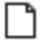

# Antennas/Calibration Sets

### Antennas/Calibration Sets

Here all the antennas considered in the project are listed, grouped by calibration set.

By default, Leica, Geo ++ and NGS calibration set come with the installation package. Leica and Geo++ consist of only Leica antennas; NGS consists of Leica and third parties antennas. The antenna manager allows you to get information about the properties of the antennas.

Select the antenna and open the Info fly-out to display the antenna PCV and offset parameters.

|  |  |
| --- | --- |

Import antennas (ANTEX format)/calibration sets:

**Import antennas (ANTEX format)/calibration sets:**

These files are available from various agencies including the International GNSS Service (IGS) or National Geodetic Survey (NGS) and have a list of antenna types by manufacturer with their respective offsets and eccentricities.

When processing baselines with third-party GNSS sensors it is suggested to use the NGS calibration set. If the antenna is not in the selected calibration set, then a NullAntenna is used for both receivers of that baseline.

Antennas can be copied to the Antenna Management through the Copy to Global option.

Add a new antenna:

**Add a new antenna:**

| 1. | Enter the antenna details in the Add Antenna property grid.You can manually enter the antenna offsets and eccentricities when needed. |
| --- | --- |
| 2. | Select Create. |

**Create**

The new antenna is added to the calibration set that you have selected in the properties and marked as    user-defined.

Create a new calibration set:

**Create a new calibration set:**

Allows you to create user-defined calibration sets, to combine antennas of different agencies into one list and use them for processing.

All antennas must be absolute or of a relative type.

| 1. | In the Antennas/Calibration Sets tab, select at least one antenna to make the option become active. |
| --- | --- |
| 2. | Select the New Calibration Set option or right-click into the selection and select Add to Calibration Set, then New Calibration Set from the context menu. |
| 3. | Enter the details in the New Calibration Set property grid. |
| 4. | Select Create. |

**New Calibration Set**

**Add to Calibration Set**

**New Calibration Set**

**Create**

The new calibration set is added and marked as    user-defined.

Add to calibration set:

**Add to calibration set:**

| 1. | In the Antennas/Calibration Sets tab, select at least one antenna to make the option become active. |
| --- | --- |
| 2. | Select the Add To Calibration Set option or right-click into the selection and select Add To from the context menu.You can only add antennas to    user-defined calibration sets.You cannot add more than one antenna with the same name (but with different calibration values) to the same user-defined calibration set.An antenna from an absolute calibration set cannot be added to a relative calibration set and vice versa. |

**Add To Calibration Set**

**Add To**

You can only add antennas to    user-defined calibration sets.

You cannot add more than one antenna with the same name (but with different calibration values) to the same user-defined calibration set.

An antenna from an absolute calibration set cannot be added to a relative calibration set and vice versa.

The antenna is added to the selected calibration set and marked as    user-defined.

Delete antennas/calibration sets:

**Delete antennas/calibration sets:**

Only    user-defined or    imported antennas/calibration sets can be deleted.

See also:

**See also:**

Antennas

The tutorial "How to Manage an Antenna Calibration Set" https://leica-geosystems.com/-/media/a633447d1f3f4afc8c7abf4a1685be6a.ashx

**"How to Manage an Antenna Calibration Set"**

The tutorial data can be downloaded in the Localisation Tool.

