# As-Built Tunnel Profiles

### As-Built Tunnel Profiles

An as-built tunnel profile consists of a sequence of points measured along the profile of a tunnel around a given chainage. Measurements along multiple chainages make up multiple tunnel profiles.

The check tunnel application on Leica Captivate supports two methods for measuring as-built profiles:

**The check tunnel application on Leica Captivate supports two methods for measuring as-built profiles:**

Data generated using either of the two methods can be imported into Infinity in DBX or HeXML format. As-built tunnel profiles can be found under the, Inspector > Infrastructure > Checked Infrastructure > Tunnels > Scanned Profiles.

**Inspector**

**Infrastructure**

**Checked Infrastructure**

**Tunnels**

**Scanned Profiles**

|  |  |
| --- | --- |

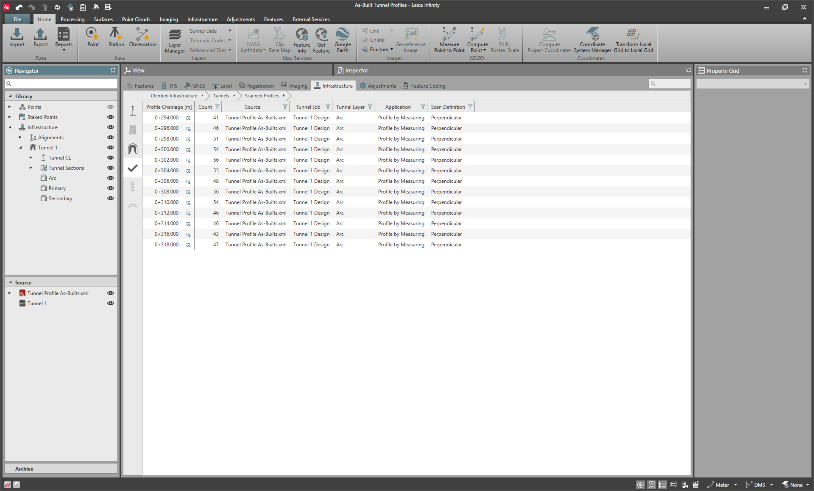

Drilling into each profile shows the list of points making up that profile and the measured data and results from the field.

|  |  |
| --- | --- |

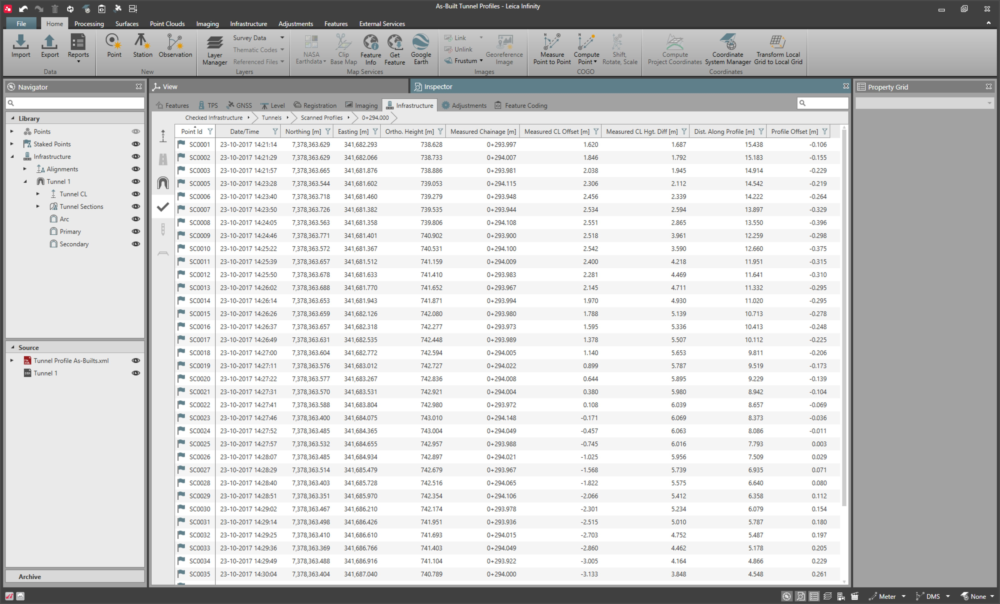

Here, the results of the as-built profiles can only be seen in a tabular format. In the Viewing As-Built Tunnel Profiles, it is shown how to view and inspect them graphically.

### Viewing As-Built Tunnel Profiles

The as-built tunnel profiles window is the dedicated tool to work with the profiles and obtain information such as overbreak and underbreak volumes, points out of tolerance and other metadata.

Within this tool, we can view the as-built profiles, compare them against design, apply top heading mask, change design layer and scan definition, and discard incorrectly measured data before reporting.

To launch the as-built profiles tool:

**To launch the as-built profiles tool:**

|  |  |
| --- | --- |

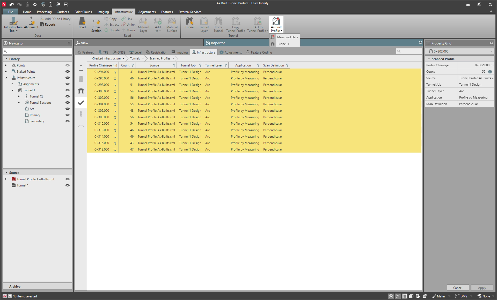

| 1. | Select one or more as-built tunnel profiles from the Inspector. |
| --- | --- |
| 2. | In the ribbon bar, select the Infrastructure tab and then select    As-Built Profile. Alternatively, right-click and select As-Built Profile. |
| 3. | Select the Measured Data or a tunnel to compare against. |

**Inspector**

**Infrastructure**

**As-Built Profile**

**As-Built Profile**

**Measured Data**

Infinity supports two methods of viewing the as-built tunnel profiles:

1. View the field measured data and results as they are, or

2.	Compare the field measured data against a tunnel design in the project.

When the first method is selected, no comparison is made against design. Infinity only shows the results as obtained from the imported DBX or HeXML. As a result, overbreak-underbreak volumes cannot be computed and design profiles cannot be shown in the view for comparison.

The tool window contains the selected profiles. Going through profiles updates the graphical view to show the as-built profile and its corresponding design profile interpolated at the selected chainage for the selected layer. Also shown in the view are the overbreak and underbreak regions and the profile offsets – deviation of as-built from design.

It is possible to control some of the data displayed in the view using survey layers in the layer manager. The overbreak and underbreak region shading and lines can be modified using tunnel overbreak and underbreak layers. As-built profile shape is always shown by a solid red line. Design profile visibility is controlled by the styling of the tunnel layer.

As-built profiles can also be selected from the chainage bar. Selecting somewhere in between the profiles does not do any interpolation. It simply picks the nearest as-built profile and displays it in the view.

|  |  |
| --- | --- |

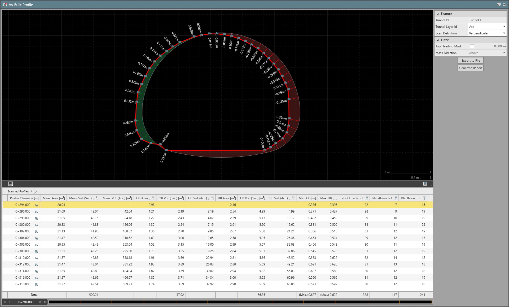

The table contains areas and volumes of the measured profiles and the overbreak and underbreak regions, maximum overbreak and underbreak and points outside of tolerance for each profile.

Lower and upper profile tolerance can be defined in Staked Points.

The volume between two profiles is calculated by averaging their cross section areas and multiplying it by the difference between the profile chainages. Volumes shown next to a profile are between the preceding profile and the current profile. As a result, no volumes are shown for the first profile.

Drilling into a profile shows the points making up the profile along with some relevant information. Any profile offset values outside of the tolerance are marked in red.

In the Making changes in the tool, it is shown how to discard measured points, apply a top heading mask and change the tunnel layer to be compared with the measured data.

### Making changes in the tool

Any changes made in the tool are not saved. Relaunching the tool with the same or a different profile resets any changes.

Turn points off

**Turn points off**

If the as-built data contains points that were measured to obstacles such as equipment or erroneous in another way, they can be turned off.

To turn off points in a profile:

**To turn off points in a profile:**

|  |  |
| --- | --- |

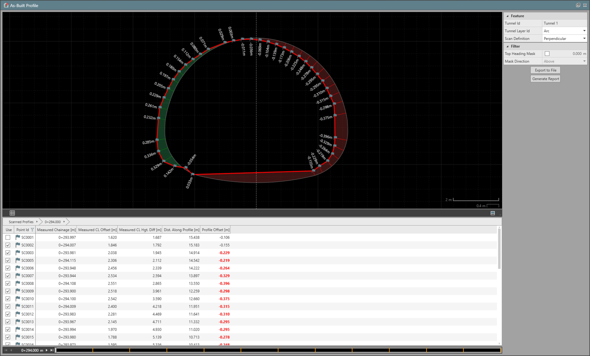

| 1. | Drill into the as-built profile. |
| --- | --- |
| 2. | Uncheck the point that must be turned off. |

When the usage of points is turned off, the as-built profile is updated. As a result, areas, volumes, and other metadata are also updated.

Applying a top heading mask

**Applying a top heading mask**

There are scenarios where pre-excavation is required before full tunnel face excavation. It is possible to enable a top heading mask to only consider part of the as-built profile at a certain height from the alignment. The direction in which the as-built is to be considered – above or below – must be specified.

In the following example, there is a top heading mask applied at four metres in the Above direction. This tells Infinity to cut off the profile and set the comparison plane at four metres from the alignment point in the positive direction (up). Above for Mask Direction, tells Infinity to only consider the as-built profile from four metres up.

**Above**

**Above**

**Mask Direction**

Setting the mask direction to below would have shown the as-built profile from four metres down. Points cannot be turned on or off when the top heading mask is enabled.

|  |  |
| --- | --- |

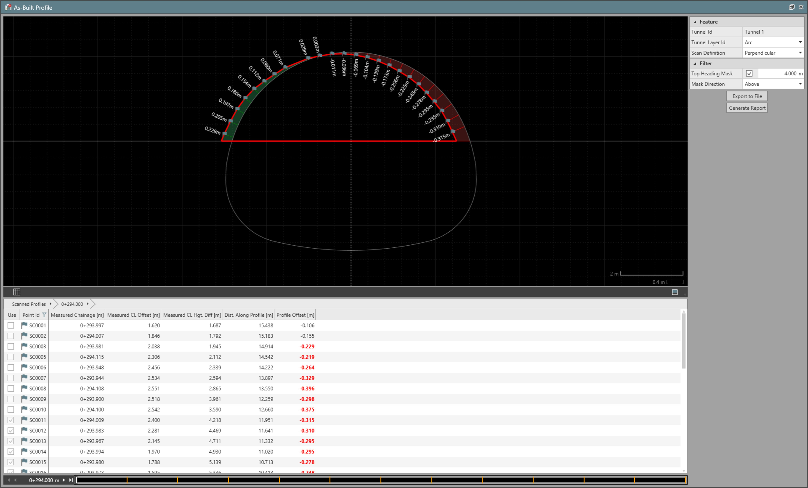

The mask is applied to all the profiles open in the tool. The quantities and metadata are updated based on the mask settings. This can help calculate and report quantities for the top heading separately.

Changing tunnel layer and scan definition

**Changing tunnel layer and scan definition**

When the tool is launched, the tunnel layer and scan definition are read from the results of the as-built profiles imported from DBX or HeXML. However, the tunnel layer can be changed in order to compare it against the as-built data. The scan definition can also be changed.

Scan definition corresponds to the direction in which a profile is assigned to the tunnel alignment – vertical or perpendicular – to the alignment.

Changing the tunnel layer or scan definition updates the quantities and metadata of the as-built tunnel profiles. A warning is shown next to each profile where there is a mismatch between field data and what is configured in the tool. Any warnings visible here are also shown in the report.

|  |  |
| --- | --- |

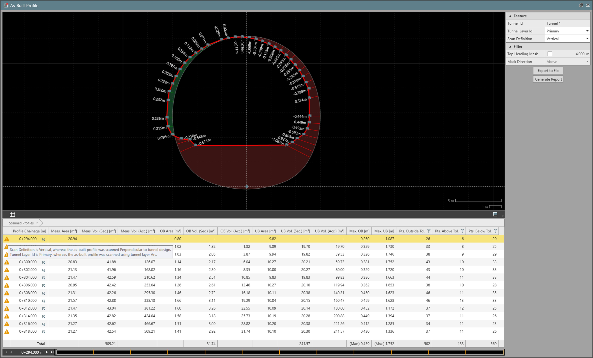

### Creating an as-built tunnel profiles report

A report can be created for the as-built profiles loaded in the tool with the changes applied by selecting Generate Report. Depending on the number of profiles and the amount of data, this can take a few seconds. Once done, an HTML report is generated and opens in the report manager which can be saved to a PDF and shared.

**Generate Report**

The report has the following information:

**The report has the following information:**

- Warnings raised, if any.
- A cross section view.
- A bar graph.
- A table of its measured points.

In the following example, a cross section view and a bar graph for a profile are shown. The graph shows the distribution of points based on their profile offset value. Bars in green denote the number of points that are within lower and upper profile tolerance. The ones further away tend to transition to red.

|  |  |
| --- | --- |

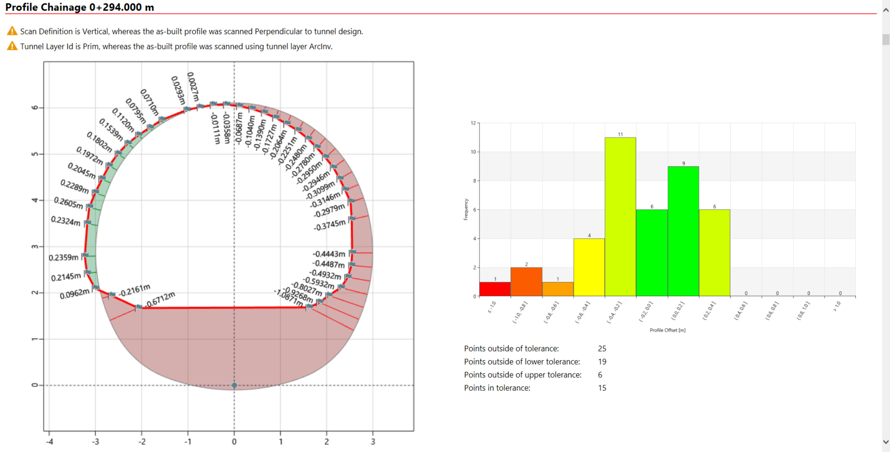

It is a good practice to only close the tool once you are happy with the report. Remember that any changes made in the tool are not saved. If you have to change how the information is displayed, this can be done quickly by making the edits while the tool is open and creating another report.

### Exporting as-built tunnel profiles to CAD

The as-built profiles can be exported to a CAD format such as dwg or dxf. This can be useful when using CAD software to prepare custom reports with ones own title block information and other data to be included in the deliverables.

To export the as-built profiles to CAD, select Export to File in the tool. In the export window, configure the export format and CAD file version. The profiles are exported in a grid format. The number of columns defines how many profiles are there to be on each row of this grid.

**Export to File**

|  |  |
| --- | --- |

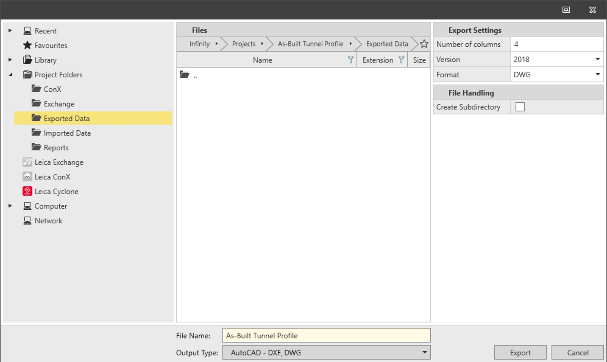

The exported profiles may appear in a grid as follows:

**The exported profiles may appear in a grid as follows:**

|  |  |
| --- | --- |

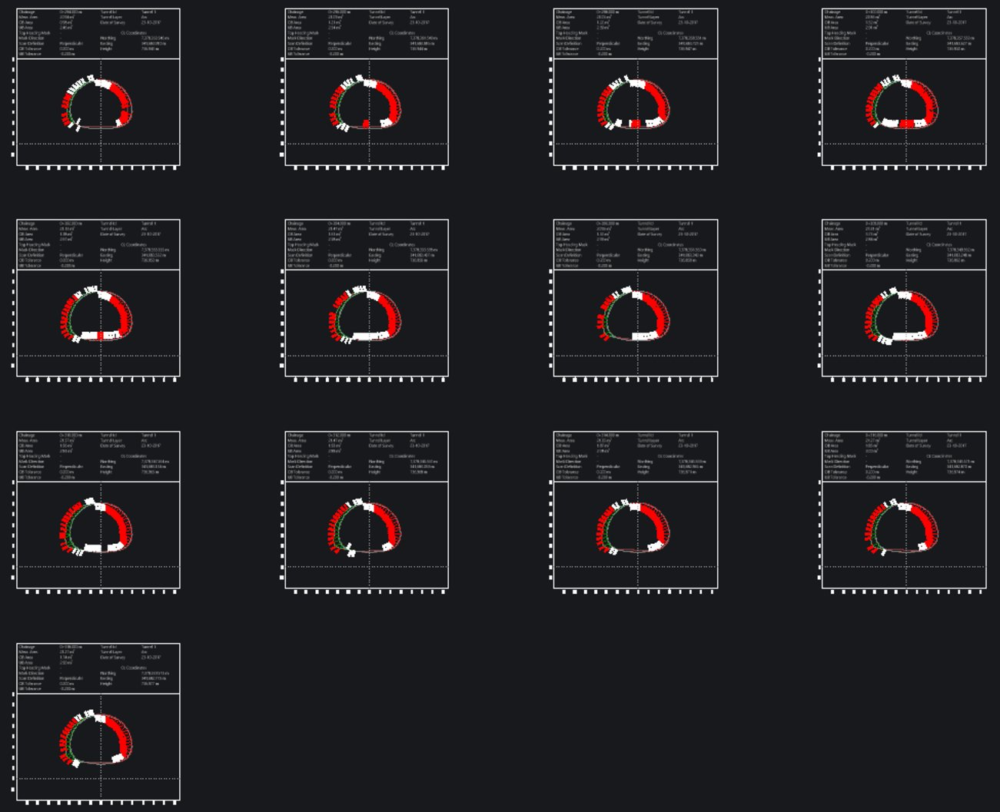

Zooming in on a profile, you can see the as-built profile, design profile, overbreak and underbreak regions, as well as profile offset labels with red ones being out of tolerance. Other relevant information such as profile chainage, configured settings and tunnel details are contained in the header.

|  |  |
| --- | --- |

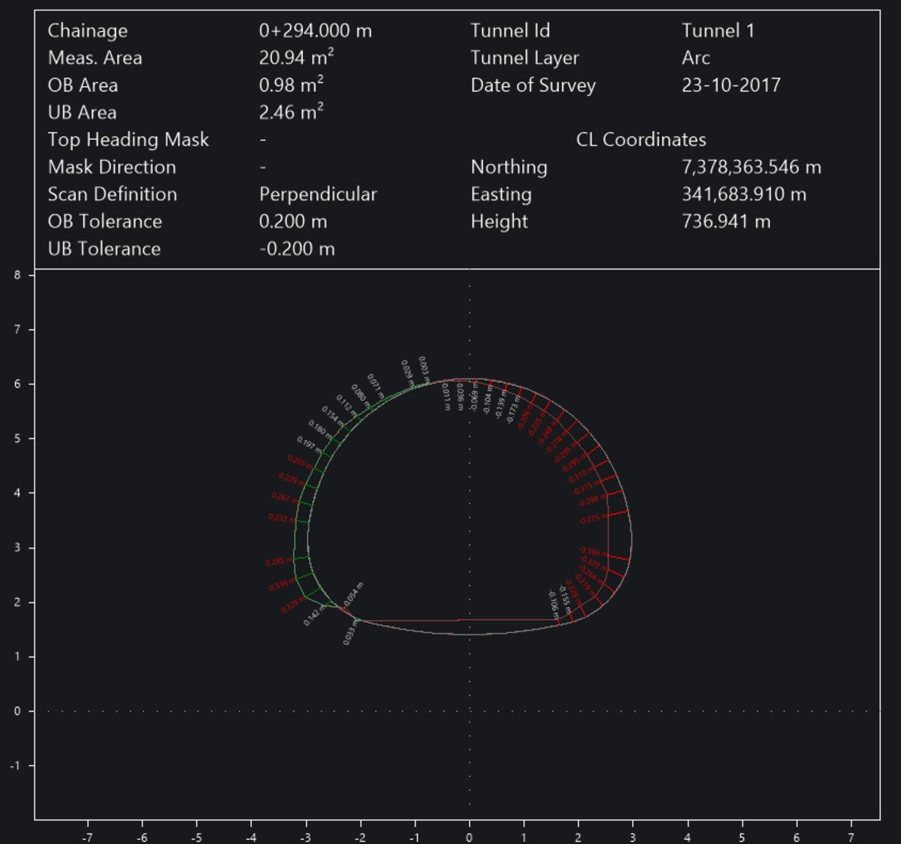

All the CAD objects are properly grouped into layers. Their appearance can be configured based on their layer properties to suit the requirements for the deliverables.

