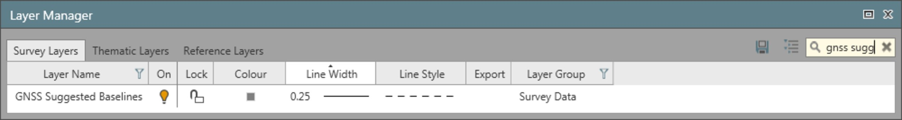

# Automatic Processing

### Automatic Processing

The automatic processing settings define the logic Infinity uses to:

**The automatic processing settings define the logic Infinity uses to:**

Suggested Baseline Strategy

**Suggested Baseline Strategy**

These parameters are considered to identify the possible baselines. If the GNSS suggested baselines layer is on, the possible baselines are automatically shown in the graphical view after importing raw data.

| Function | Description |
| --- | --- |
| Min. Baseline Duration | This sets the minimum amount of time over which simultaneous measurements are taken at two stations before Infinity tries to show the preview and process the baseline between the stations. |
| Max. Baseline Length | Sets the maximum length of baselines up to which Infinity shows the baselines in the preview and process. |
| Re-Compute already computed Baselines | If this option is checked, baselines that have been calculated and stored previously are proposed again as suggested baselines and sent to the processing. |
| Compute Baselines between Control Points | If this option is checked, baselines between control points role are also processed. This may be interesting if the control points are not kept absolutely fixed in a subsequent adjustment. |

**Min. Baseline Duration**

**Max. Baseline Length**

**Re-Compute already computed Baselines**

**Compute Baselines between Control Points**

Auto Processing Strategy

**Auto Processing Strategy**

| Function | Description |
| --- | --- |
| Baseline Processing | All: Infinity processes all possible combinations of baselines that conform to the automatic processing parameters.Independent sets: Infinity only processes a set of independent baselines. Between n points which are measured at the same time only n-1 independent baselines exist. |
| Priority to Baseline with | Shorter Slope Distance: The shortest baseline from the first reference point is computed first. Infinity then decides which is the next shortest baseline. This may be from the first point or from the point that was last computed. This line is processed next and then the process is repeated. This is also dependent on the other automatic processing parameters.Longer Duration: The baseline with the longest common observation time is computed first. Similarly, to the distance method, Infinity then decides which point has the next longest common observation time and processes that line. The process continues like that. This is also dependent on the other automatic processing parameters. |
| Session by Session | If this option is checked, Infinity computes all possible baselines from the reference that has been identified according to the selected seeding strategy before proceeding with the next reference. The point with the longest interval is selected as the first reference. |
| Allow to use Float solution as Reference | Allow points whose solution is float to be used as reference points for further processing. |

**Baseline Processing**

**All**

**Independent sets**

**n**

**n-1**

**Priority to Baseline with**

**Shorter Slope Distance**

**Longer Duration**

**Session by Session**

**Allow to use Float solution as Reference**

General

**General**

| Function | Description |
| --- | --- |
| Set Intervals to Auto at Import | If this option is checked, Infinity sets all the intervals to automatic immediately after data import.This setting is suggested in case you measured a GNSS network with many sessions of reference and rover, and you want to process all the possible baselines in one go. If this option is checked, you should only import all the data and select Process. |

**Set Intervals to Auto at Import**

**Process**

