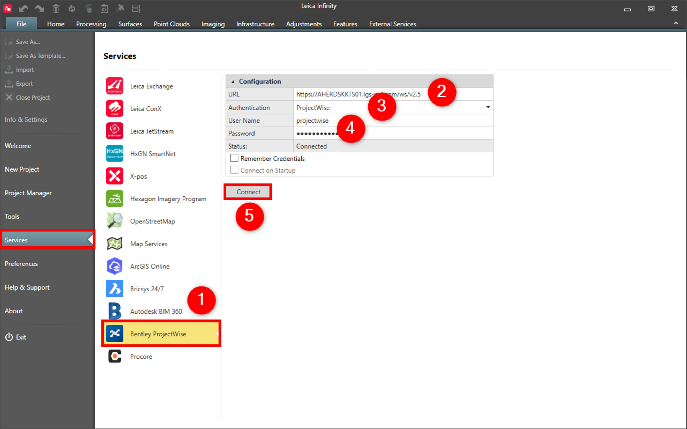
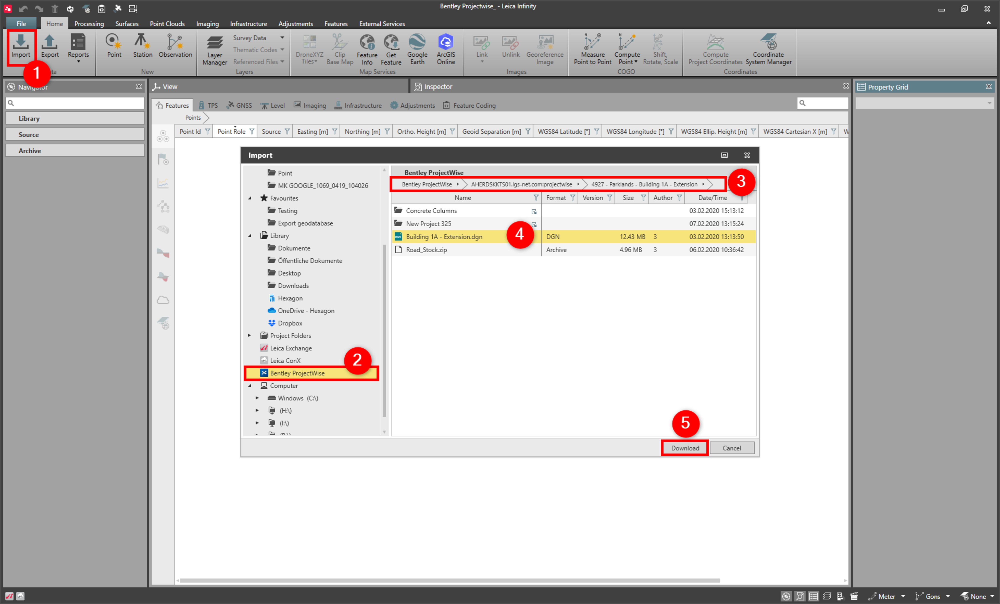
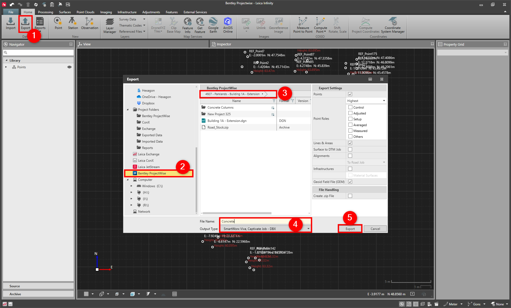

# Bentley ProjectWise

### Bentley ProjectWise

Infinity supports the Bentley ProjectWise service.

Transfer objects easily between Infinity and the ProjectWise server.

Infinity currently supports version 2.0 and above of the ProjectWise Application Program Interface (API).

**Requirements:**

- Valid subscription.

To connect to the Bentley ProjectWise service:

**To connect to the Bentley ProjectWise service:**

|  |  |
| --- | --- |

| 1. | Select File, then Services and then Bentley ProjectWise from the menu. |
| --- | --- |
| 2. | Enter the URL.To use the Bentley Projectwise service, enter the full URL, of the Web Service Gateway instance.For example: https://myserver.com/ws/v2.5 (where "v2.5" represents the Projectwise API version).Contact your organisation Projectwise administrator to obtain the URL. |
| 3. | Select the Authentication method from the drop-down list.Choose to authenticate through:Bentley IMS (Federated Identity) - Choose this option when the Bentley Connection Client is required for the ProjectWise connection.ProjectWise (Non-Federated Identity) - Choose this option when the Bentley Connection Client is not required for the ProjectWise connection. |
| 4. | Enter the User Name and the Password. |
| 5. | Select Connect. |

**File**

**Services**

**Bentley ProjectWise**

**URL**

- For example: https://myserver.com/ws/v2.5 (where "v2.5" represents the Projectwise API version).
- Contact your organisation Projectwise administrator to obtain the URL.

- **Bentley IMS** (Federated Identity) - Choose this option when the Bentley Connection Client is required for the ProjectWise connection.
- **ProjectWise** (Non-Federated Identity) - Choose this option when the Bentley Connection Client is not required for the **ProjectWise** connection.

**User Name**

**Password**

**Connect**

- Select remember credentials.
- Connect on start-up.

To import data:

**To import data:**

|  |  |
| --- | --- |

| 1. | Select Import from the Home tab. |
| --- | --- |
| 2. | In the Import window, select Bentley ProjectWise from the drive list. |
| 3. | View the available files in the Bentley ProjectWise window. |
| 4. | Highlight the file to import to the project and if necessary specify the import settings.The selected file is imported to Infinity and downloaded to the Bentley ProjectWise directory, in the current Infinity project directory. |
| 5. | Select Download. |

**Import**

**Bentley ProjectWise**

The selected file is imported to Infinity and downloaded to the Bentley ProjectWise directory, in the current Infinity project directory.

**Download**

To export data:

**To export data:**

|  |  |
| --- | --- |

| 1. | Select Export from the Home tab. |
| --- | --- |
| 2. | In the Export window, select Bentley ProjectWise from the drive list. |
| 3. | In the Bentley ProjectWise window, select the location to export the data to. |
| 4. | Enter a File Name and select the Output Type. |
| 5. | Select Export. |

**Export**

**Bentley ProjectWise**

**File Name**

**Output Type**

**Export**

The Bentley ProjectWise data is always copied to the current Infinity project directory.

See also:

**See also:**

The video "Leica Infinity - Services - How to use Bentley ProjectWise" https://www.youtube.com/watch?v=0DEvgPXL4Mg

**"Leica Infinity - Services - How to use Bentley ProjectWise"**

