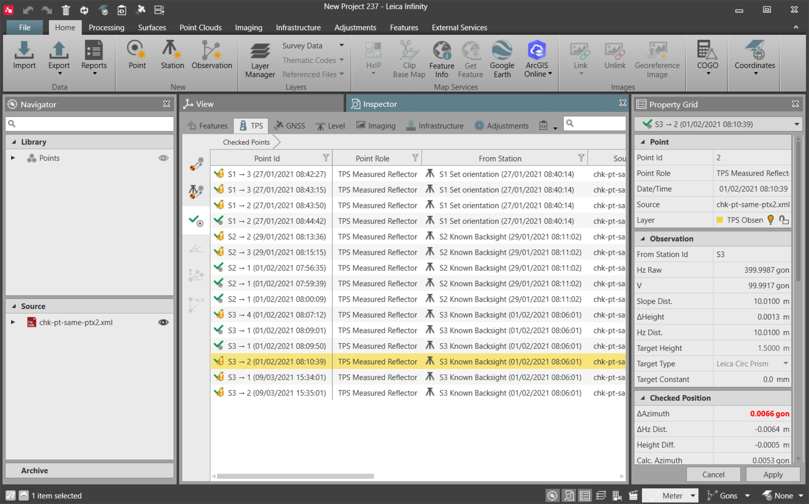

# Checked Points

### Checked Points

The checked points subtab lists all the points measured in the field with Captivate using the checked point application.

Points with at least one of the checked values out of tolerance, are indicated with an exclamation mark. You can find out more information about the out of tolerance values, by hovering the mouse over the icon with the exclamation mark.

Infinity can create Reports for the checked points application results.

|  |  |
| --- | --- |

The out of tolerance limits are defined in Checked Points.

Currently, the checked point application results are not updated when the setup is updated and these observations cannot be modified.

See also:

**See also:**

Reports

