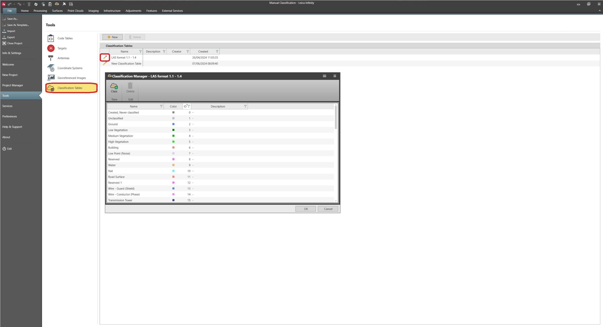

# Classification Tables

### Classification Tables

Classification tables are mappings between classification ID, class names and class colours that are assigned to a group of point cloud points.

The Classification Tables tab, under File > Tools, allows you to create, edit or delete classification tables in the global area.

**File**

**Tools**

If no custom classification tables have been created, only the default classification table “LAS format 1.1 – 1.4” is available.

|  |  |
| --- | --- |

To edit a specific classification table, select the    option, to open the Classification Manager.

The classification manager, allows you to:

- Edit a specific classification table by creating/deleting new classes.
- Change the existing classes; name, colour, or ID number.
- Add a description for each class.

Changes done to the classification table in the global area, do not affect existing projects that use that classification table. The changes are applied to any new project.

It is not possible to change the name and ID of existing classes for the default classification table “LAS format 1.1 – 1.4”.

Classes from the standard classification table “LAS format 1.1 – 1.4” cannot be deleted, but new classes can be added at the end of the list.

