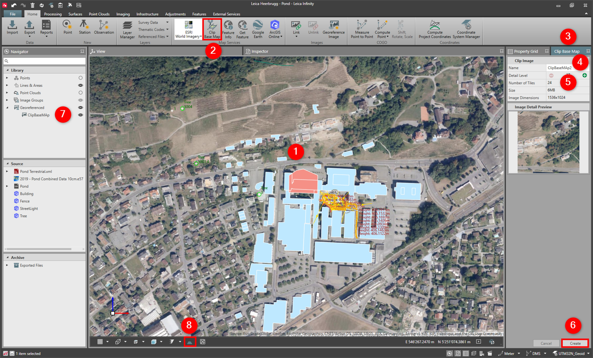

# Clip Base Map

### Clip Base Map

With clip base map, it is possible to clip the base map and store it to the project as a georeferenced image.

When you clip the base map, the image or map that is downloaded is what you see as displayed in the graphical view.

**Requirements:**

- Active base map.

To clip base map:

**To clip base map:**

|  |  |
| --- | --- |

| 1. | Navigate to the map area you want to download. |
| --- | --- |
| 2. | Select Clip Base Map from the ribbon bar. |
| 3. | The clip base map window opens. |
| 4. | Enter a Name for the georeferenced image to download. |
| 5. | Select the level of detail.Available depending on the service set as the active base map.Base map image services, use tiles of images to cover the area of display. When you download an image, it is therefore downloading tiles, the detail level of the tiles starts from the display in the graphical view. You can increase the level of detail for the image tiles to download. The detail level is normally indicated by a number between the range of 1 - 20, where 20 is the highest level of detail. Keep in mind that the more detail you want to download, the larger the size of image tiles being downloaded. The maximum number of tiles possible to download is 1200, regardless of the level of detail. |
| 6. | Select Create. |
| 7. | Georeferenced images are shown as objects in the library and can be set to visible or not visible. |
| 8. | Enable the 3D terrain from the graphical view tool bar.All clipped base maps can be viewed in 3D.The default DEM has a resolution of approximately one arcsecond. |

**Clip Base Map**

**Name**

Available depending on the service set as the active base map.

Base map image services, use tiles of images to cover the area of display. When you download an image, it is therefore downloading tiles, the detail level of the tiles starts from the display in the graphical view. You can increase the level of detail for the image tiles to download. The detail level is normally indicated by a number between the range of 1 - 20, where 20 is the highest level of detail. Keep in mind that the more detail you want to download, the larger the size of image tiles being downloaded. The maximum number of tiles possible to download is 1200, regardless of the level of detail.

**Create**

**visible**

**not visible**

**3D terrain**

All clipped base maps can be viewed in 3D.

The default DEM has a resolution of approximately one arcsecond.

When exporting a project with georeferenced images to Captivate, the georeferenced images are also exported. To export a georeferenced image to Captivate simply attach it to a project and export the project to Captivate.

See also:

**See also:**

Base Map

The video "Leica Infinity - Home Module - Using Base Maps" https://www.youtube.com/watch?v=ZPXJSI3WWVM

**"Leica Infinity - Home Module - Using Base Maps"**

