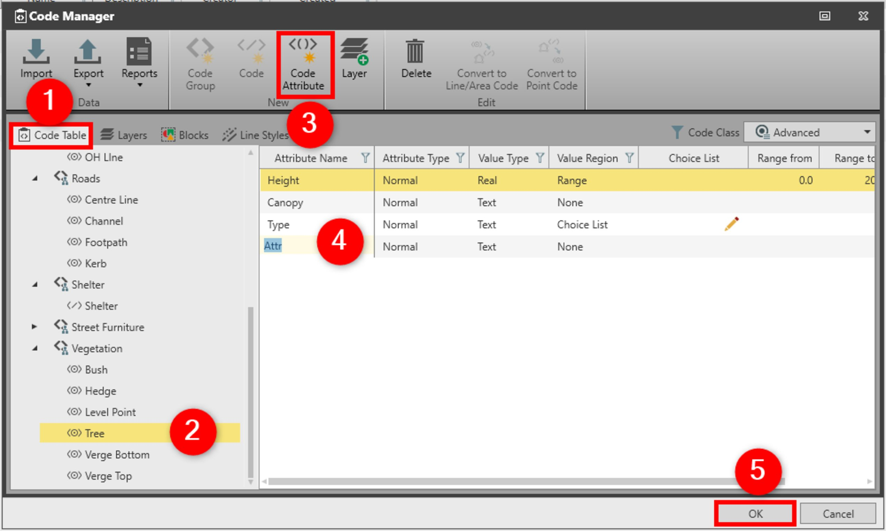

# Code Attribute

### Code Attribute

Attributes are the tertiary building block of a code table. Attributes prompt you to enter information describing a code. You can add new attributes, modify or delete existing attributes of a code.

For example, attributes for the code tree could be species, diameter and remark.

Each code may have one or more attributes attached to it. Attributes are the tertiary building block of a code table. Attributes prompt you to enter information describing a code.

For example, the code tree could have the attributes diameter, species, height, and remark attached to it. You may then define an attribute value for an attribute. It may be chosen from a predefined choice list or a predefined range. For example, possible values for the attribute diameter could be from a range from 1 to 25 metres and the attribute species from a choice list that has the values pine, fir and oak.

You do not have to define an attribute value within code management. If no value is defined for an attribute you may enter a value or description in the field.

To add new attribute:

**To add new attribute:**

|  |  |
| --- | --- |

| 1. | In the Code Manager, select the Code Table tab. |
| --- | --- |
| 2. | Select the code to which you want to add a new attribute in the navigator. |
| 3. | Select Code Attribute from the ribbon bar. |
| 4. | In the content area, a new attribute is created with default settings that you can modify.To copy attributes between codes use Ctrl C and Ctrl V. |
| 5. | Select OK to save the changes and to close the Code Manager. |

**Code Table**

**Code Attribute**

To copy attributes between codes use Ctrl C and Ctrl V.

**OK**

An attribute consists of:

**An attribute consists of:**

| Name | Type | Description |
| --- | --- | --- |
| Attribute Name |  | The Attribute Name may consist of alphanumeric characters and may be maximum 13 characters long.For Leica Captivate V2.30 and higher, the allowed length is 48 characters when ASCII characters are used. If other than ASCII characters are used, then it depends on the character set whether longer names are truncated on export.Codelists and jobs with names longer than 16 characters cannot be imported to any Infinity version lower than 2.4. |
| Attribute Type | Normal | The attribute value can be edited in the field. |
| Mandatory | The attribute value can be edited in the field. |
| Fixed | No value is shown on the instrument and the default value is automatically attached to the attribute. |
| Value Type | Text | Possible values may only be entered in a choice list. For example, for the attribute species choose text as the value type. |
| Real | You have the possibility of entering a choice list or a range of possible values. |
| Integer | You have the possibility of entering a choice list or a range of possible values. For example, for the attribute diameter choose integer as the value type. |
| Value Region | None | For example, for the remark attribute choose none. |
| Range | Enter or modify the interval (range from/to). For example, for the attribute diameter a range from 1 to 5 metres could be defined. |
| Choice List | Enter or modify a list of possible attribute values. For example oak, pine and fir could be possible choice list entries for the attribute species.To add new values to the choice list select Add.To remove values from the choice list select Delete.To modify the sequence of the values in the choice list select Move Up/Move Down. |
| Default Value |  | Optional. |
|  | Enter default value, for value region choice list or range. |
|  | If the attribute type is fixed, enter a default value otherwise no attribute value is set. |

**Attribute Name**

For Leica Captivate V2.30 and higher, the allowed length is 48 characters when ASCII characters are used. If other than ASCII characters are used, then it depends on the character set whether longer names are truncated on export.

Codelists and jobs with names longer than 16 characters cannot be imported to any Infinity version lower than 2.4.

**Attribute Type**

**Value Type**

**Value Region**

- To add new values to the choice list select **Add**.
- To remove values from the choice list select **Delete**.
- To modify the sequence of the values in the choice list select **Move Up/Move Down**.

**Default Value**

See also:

**See also:**

Code Tables

The video "Leica Infinity - Feature Coding Part 1 - How to create a Code Table & Codelist" https://www.youtube.com/watch?v=9Mf8E0trTXA

**"Leica Infinity - Feature Coding Part 1 - How to create a Code Table & Codelist"**

The video "Leica Infinity - Feature Coding Part 4 - How to process features and export to CAD" https://www.youtube.com/watch?v=ASLoVHHAYGQ

**"Leica Infinity - Feature Coding Part 4 - How to process features and export to CAD"**

