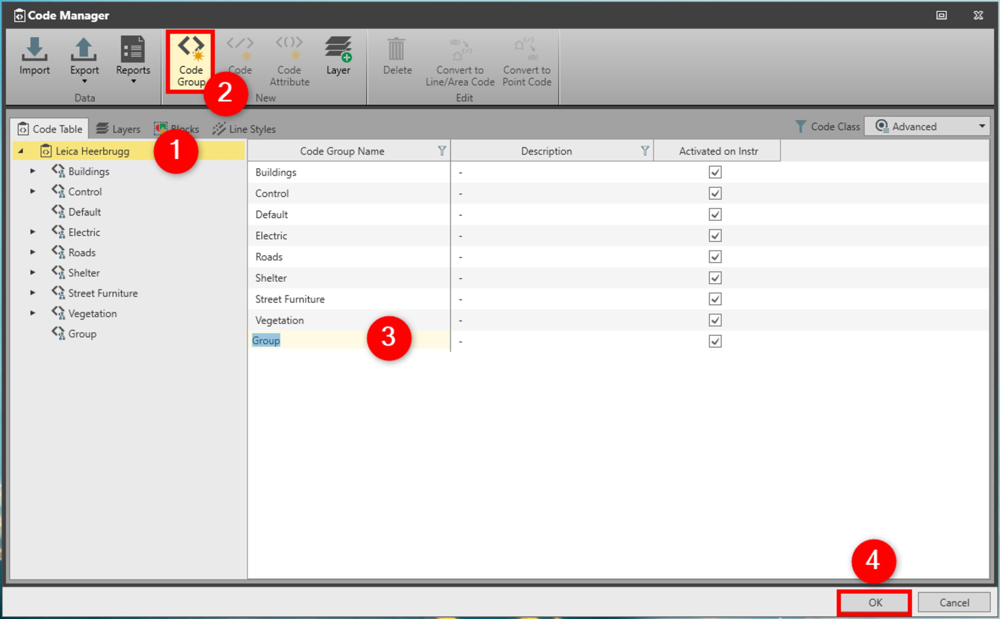

# Code Group

### Code Group

Code groups are the primary building blocks of a code table and describe groups of objects, which have a common theme. For example, utilities, vegetation, buildings or roads. Grouping helps to manage codes by activating or deactivating groups on board the instrument.

A code table may have as many code groups as you define. Each code group then has subcomponents known as codes and attributes.

Code group names may be up to 16 characters long and may consist of alphanumeric characters.

You can add new code groups, modify existing code groups and Delete code groups.

To add a new code group:

**To add a new code group:**

|  |  |
| --- | --- |

| 1. | Select the Code Table in the Code Manager. |
| --- | --- |
| 2. | Select Code Group. |
| 3. | In the content area, a new group is created with default settings that you can modify.A Code Group Name must be unique and may be up to 16 characters long.A description is optional. |
| 4. | Select OK to save the changes and to close the Code Manager |

**Code Group**

A Code Group Name must be unique and may be up to 16 characters long.

A description is optional.

**OK**

See also:

**See also:**

Code Tables

The video "Leica Infinity - Feature Coding Part 1 - How to create a Code Table & Codelist" https://www.youtube.com/watch?v=9Mf8E0trTXA

**"Leica Infinity - Feature Coding Part 1 - How to create a Code Table & Codelist"**

The video "Leica Infinity - Feature Coding Part 4 - How to process features and export to CAD" https://www.youtube.com/watch?v=ASLoVHHAYGQ

**"Leica Infinity - Feature Coding Part 4 - How to process features and export to CAD"**

