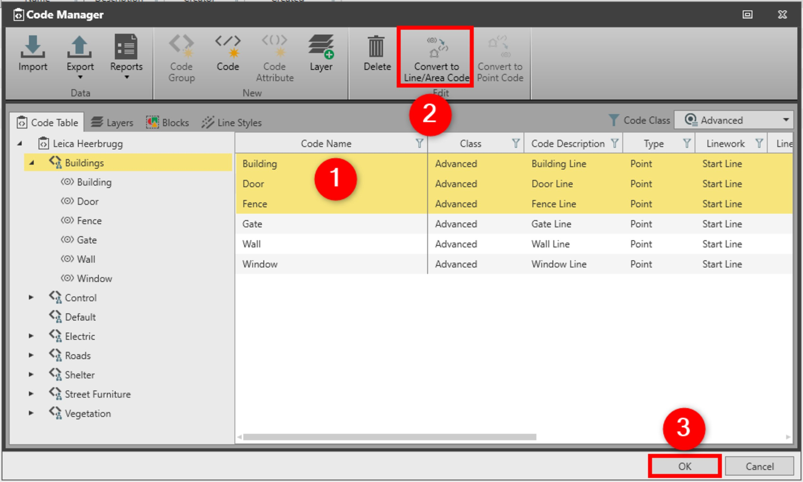

# Convert to Line/Area Code

### Convert to Line/Area Code

The convert to line/area code option is useful when data has to be exported to GIS, CAD or VIVA where the point linework is not supported.

To convert to line/area code:

**To convert to line/area code:**

|  |  |
| --- | --- |

| 1. | In the Code Manager, select one or more point codes with linework.You can also select the whole code group. |
| --- | --- |
| 2. | Select Convert to Line/Area Code.Points with linework, start line convert to lines and the start area convert to area. |
| 3. | Select OK to save the changes and to close the Code Manager. |

You can also select the whole code group.

**Convert to Line/Area Code**

Points with linework, start line convert to lines and the start area convert to area.

**OK**

See also:

**See also:**

Code Tables

The video "Leica Infinity - Feature Coding Part 1 - How to create a Code Table & Codelist" https://www.youtube.com/watch?v=9Mf8E0trTXA

**"Leica Infinity - Feature Coding Part 1 - How to create a Code Table & Codelist"**

