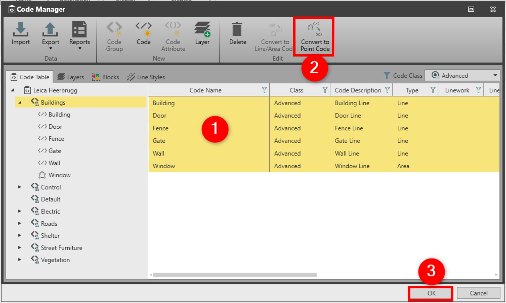

# Convert to Point Code

### Convert to Point Code

The convert to point code option is useful when you want to use your existing line/area codes in Captivate where only the point linework is supported.

To convert to point code:

**To convert to point code:**

|  |  |
| --- | --- |

| 1. | In the Code Manager, select one or more codes of type line or area.You can also select the whole code group. |
| --- | --- |
| 2. | Select Convert to Point Code.All selected codes are converted to the type point with linework start line or start area. |
| 3. | Select OK to save the changes and to close the Code Manager. |

You can also select the whole code group.

**Convert to Point Code**

All selected codes are converted to the type point with linework start line or start area.

**OK**

See also:

**See also:**

Code Tables

The video "Leica Infinity - Feature Coding Part 1 - How to create a Code Table & Codelist" https://www.youtube.com/watch?v=9Mf8E0trTXA

**"Leica Infinity - Feature Coding Part 1 - How to create a Code Table & Codelist"**

