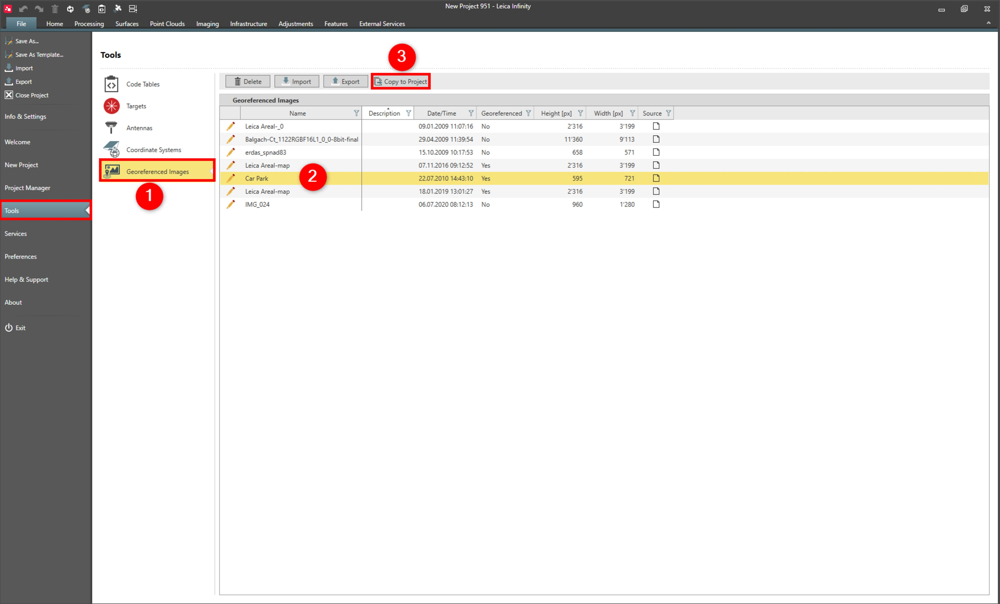

# Copy to Project

### Copy to Project

Georeferenced images can be copied to the currently open project.

**Requirements:**

- The image must be georeferenced.
- The project must be opened before this option is available.

To copy to a project:

**To copy to a project:**

|  |  |
| --- | --- |

| 1. | Select File, then Tools and then Georeferenced Images from the menu. |
| --- | --- |
| 2. | Select the image you want to copy. |
| 3. | Select Copy to Project. |

**File**

**Tools**

**Georeferenced Images**

**Copy to Project**

See also:

**See also:**

Local and Global Data Objects

Georeference Images

The video "Leica Infinity - Home Module - Georeferencing Images" https://www.youtube.com/watch?v=m-U29-ipJgs

**"Leica Infinity - Home Module - Georeferencing Images"**

