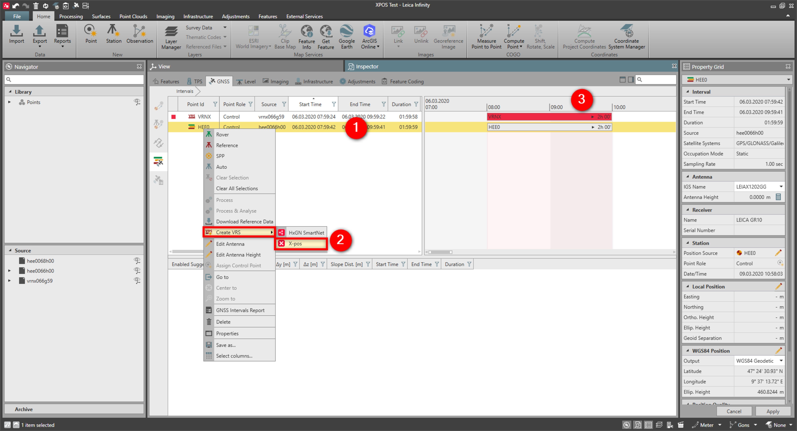

# Create a Virtual Reference Station (VRS)

### Create a Virtual Reference Station (VRS)

A Virtual Reference Station (VRS) is created nearby the rover position by exploiting corrections, tropospheric and ionospheric modelling coming from a network of physical reference stations.

Infinity creates VRS exploiting the HxGN SmartNet GNSS reference stations. Rover data from short baselines can be processed resulting in an accurate final VRS position.

**Requirements:**

- Valid subscription for HxGN SmartNet or X-pos.

How to create a VRS:

**How to create a VRS:**

|  |  |
| --- | --- |

| 1. | From the GNSS interval view, select the intervals that you want to post-process using a VRS. |
| --- | --- |
| 2. | Select Create VRS from the GNSS ribbon bar or from the context menu. |
| 3. | Infinity connects to the SmartNet network to download the RINEX file of the VRS.The VRS data is directly imported into the project.The additional interval is set to reference automatically.A VRS can only be set as reference. A VRS cannot be set as rover or SPP. |

**Create VRS**

A VRS can only be set as reference. A VRS cannot be set as rover or SPP.

When the VRS is created starting from one interval, one virtual reference station is created in the location of the selected interval.

When the VRS is created starting from multiple intervals, Infinity creates one VRS (in the average position) or multiple VRS (in the location of each selected interval). This depends on the specified advanced settings for the VRS set in Advanced Settings.

See also:

**See also:**

HxGN SmartNet

X-pos

