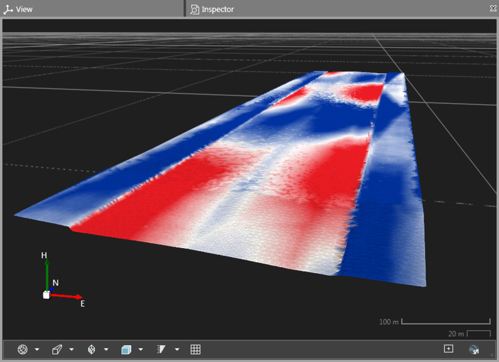
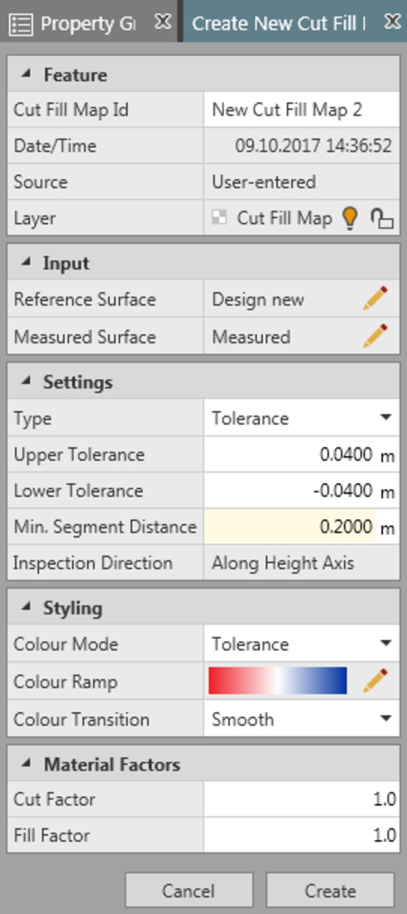
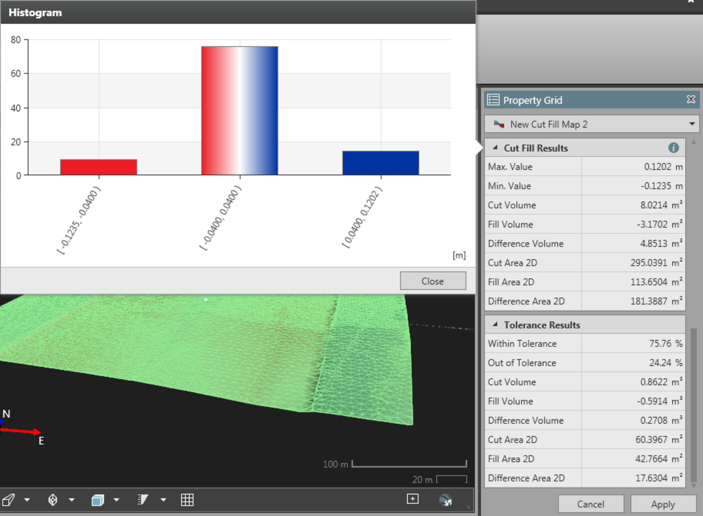
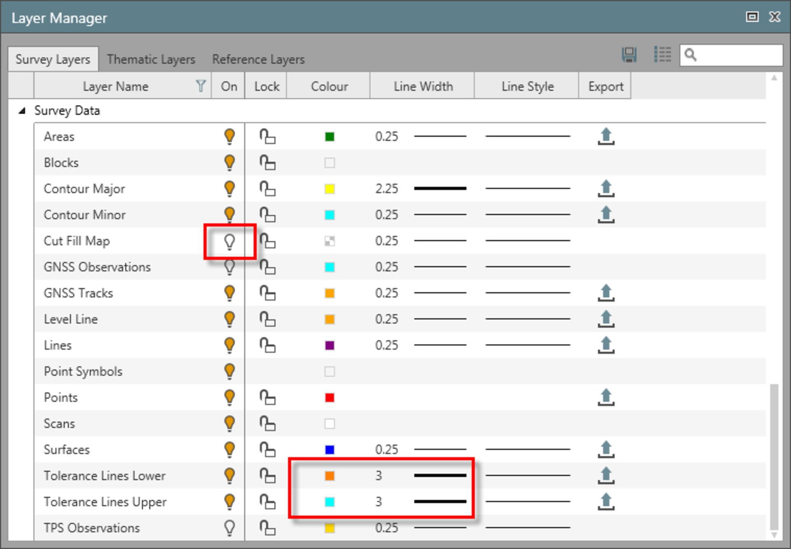
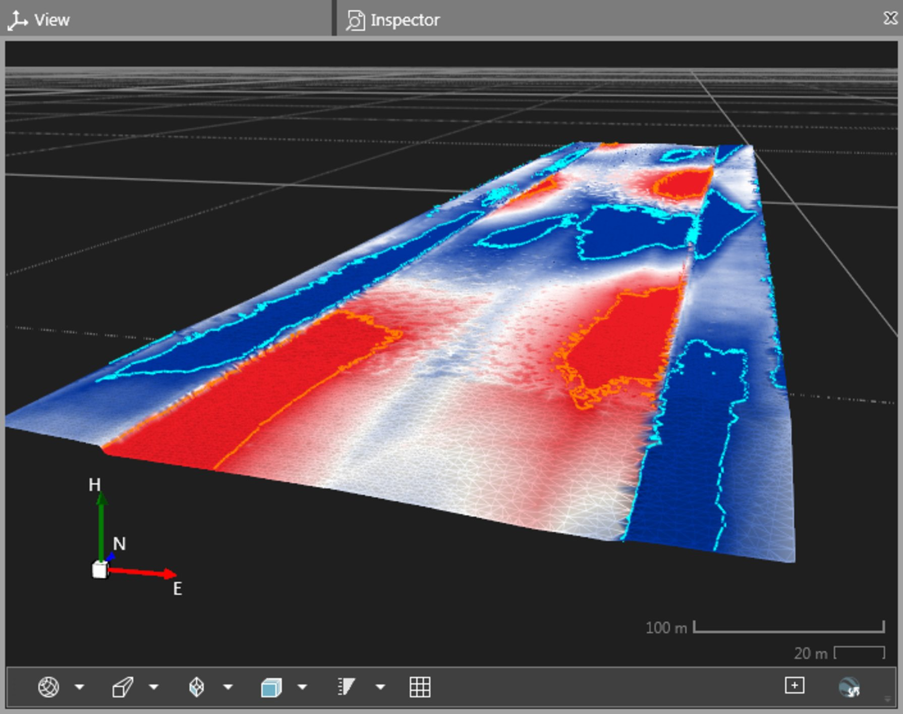
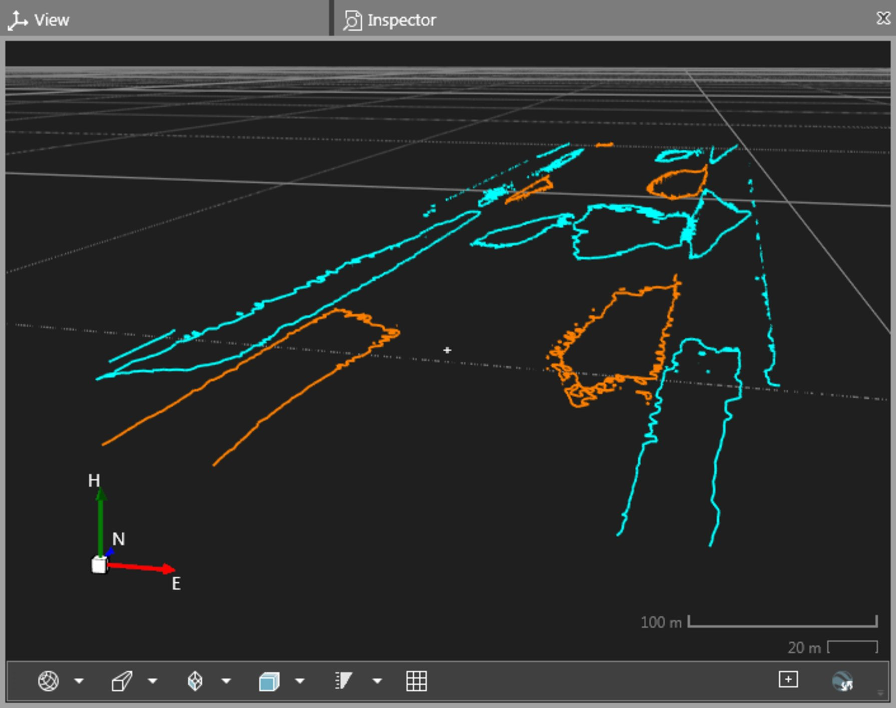
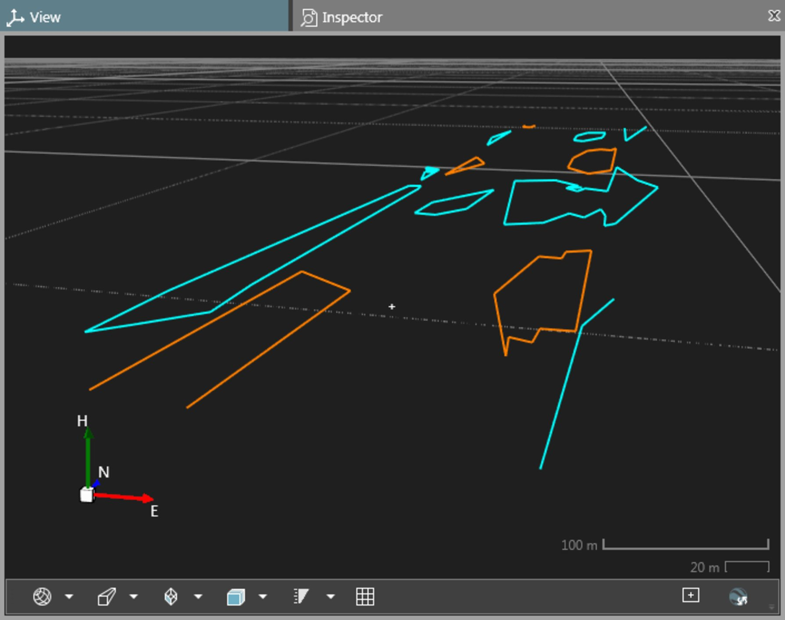

# Cut Fill Maps

### Cut Fill Maps

Cut fill maps is a surfaces function that allows you to compare a measured surface to a design surface, called reference surface in Infinity. Height differences are colour-coded and shown in a so-called cut fill map. The cut fill map is saved to the database as an Infinity object. By default, it shows in blue volumes that need to be cut to reach the level of the reference surface. Volumes that need to be filled are indicated in red.

Sample of a road design:

**Sample of a road design:**

|  |  |
| --- | --- |

How to calculate a cut fill map:

**How to calculate a cut fill map:**

| 1. | Go to the Surfaces tab and select Cut Fill Map from the Surfaces ribbon bar.The Create New Cut Fill Map window opens up next to the regular property grid. |  |
| --- | --- | --- |
| 2. | Select    a Reference Surface (design) and a Measured Surface as input to the cut/fill calculation.You can also first select a Reference Surface (design) and a Measured Surface in the Navigator or the Features Inspector and then select New Cut Fill Map from the context menu. In this case the property grid opens up and reference and design surface is already selected. The surface you select first is identified as the reference surface. The second surface you select is automatically identified as the measured surface. |
| 3. | Under Settings select whether you want to compute only height differences or height differences with respect to given tolerance values.If you select Tolerance, specify the upper and lower tolerance values, too and define a Min. Segment Distance. Through the Min. Segment Distance value you can simplify the tolerance lines. The tolerance lines indicate the areas in the map where material has to be cut or filled. These lines can be exported for stake-out, but if they are too detailed the controller might not be able to handle them. |
| 4. | Under Styling define which colours shall be used for indicating cut/fill areas.By default, blue is used for volumes that need to be cut and red is used for volumes that need to be filled. Default values for Settings and Styling can be defined in the surfaces Parameters option.Select Parameters from the Surfaces ribbon bar to open.To reset Settings and Styling to the factory defaults go to the File tab > Info & Settings > Surfaces & Contours and select the Defaults option. |
| 5. | Under Material Factors you can enter factors by which the cut/fill volumes shall be multiplied. The material factors are used to better estimate the volume of material to move. |
| 6. | Select Create at the bottom of the property grid to create the new cut fill map. |

**Surfaces**

**Cut Fill Map**

**Reference Surface**

**Measured Surface**

You can also first select a Reference Surface (design) and a Measured Surface in the Navigator or the Features Inspector and then select New Cut Fill Map from the context menu. In this case the property grid opens up and reference and design surface is already selected. The surface you select first is identified as the reference surface. The second surface you select is automatically identified as the measured surface.

**New Cut Fill Map**

The tolerance lines indicate the areas in the map where material has to be cut or filled. These lines can be exported for stake-out, but if they are too detailed the controller might not be able to handle them.

Default values for Settings and Styling can be defined in the surfaces Parameters option.

Select Parameters from the Surfaces ribbon bar to open.

**Parameters**

To reset Settings and Styling to the factory defaults go to the File tab > Info & Settings > Surfaces & Contours and select the Defaults option.

**File**

**Info & Settings**

**Surfaces & Contours**

**Defaults**

**Create**

Cut Fill Results and Tolerance Results

**Cut Fill Results and Tolerance Results**

If tolerances have been used for the calculation, they are added as properties of the cut fill map to the Property Grid and the Features Inspector.

Inspecting cut fill results:

**Inspecting cut fill results:**

| In the Property Grid select the    option to see a histogram of the calculation results. |
| --- |
| In order to generate a report on one or more cut fill maps, select the maps in the Navigator or the Inspector and either select Reports > Cut Fill Map Report from the Home ribbon bar or right-click and select Cut Fill Map Report from the context menu.In order to focus the graphical view on just showing the cut fill map make other objects invisible by selecting the    option in the Navigator. |
| In the Layer Manager you can select different colours for the so-called Tolerance Lines Upper and Tolerance Lines Lower to enhance their visibility in the graphical view. You can also adapt the line width or change the line style. If you switch off    the Cut Fill Map itself, you can focus on the tolerance lines in the graphical view. |

- In the Property Grid select the    option to see a histogram of the calculation results.

- In order to generate a report on one or more cut fill maps, select the maps in the Navigator or the Inspector and either select **Reports** > Cut Fill Map Report from the Home ribbon bar or right-click and select Cut Fill Map Report from the context menu.
- In order to focus the graphical view on just showing the cut fill map make other objects invisible by selecting the    option in the Navigator.

- In the Layer Manager you can select different colours for the so-called Tolerance Lines Upper and Tolerance Lines Lower to enhance their visibility in the graphical view. You can also adapt the line width or change the line style. If you switch off    the Cut Fill Map itself, you can focus on the tolerance lines in the graphical view.

Workflow

**Workflow**

A typical workflow making use of cut fill maps would be:

**A typical workflow making use of cut fill maps would be:**

| 1. | Measure, for example, a road that is being built based on a given design. |
| --- | --- |
| 2. | Import the measured data and the design surface from CAD to Infinity. |
| 3. | Calculate the surface resulting from the measurements. |
| 4. | Compare the surface to the design by calculating a cut fill map. Here you can make use of tolerances by entering the values. The cut fill map only shows areas and volumes to be cut or filled that are beyond the entered tolerance values.The areas where material needs to be moved are indicated by contour lines called Tolerance Lines Lower and Tolerance Lines Upper. These contour lines can be exported to DXF. |
| 5. | Use the exported upper and lower tolerance lines for stake-out of the out-of-tolerance areas in the field. |

Illustration showing the tolerance lines upper and lower where material still needs to be moved to reach the design surface:

**Illustration showing the tolerance lines upper and lower where material still needs to be moved to reach the design surface:**

|  |  |
| --- | --- |

|  |  |
| --- | --- |

The styling of the tolerance lines has been modified in the Layer Manager to enhance their visibility against the cut fill map itself.

To use the lines for stake-out in the field make use of the Min. Segment Distance to simplify the lines:

**To use the lines for stake-out in the field make use of the Min. Segment Distance to simplify the lines:**

|  |  |
| --- | --- |

