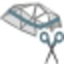
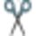
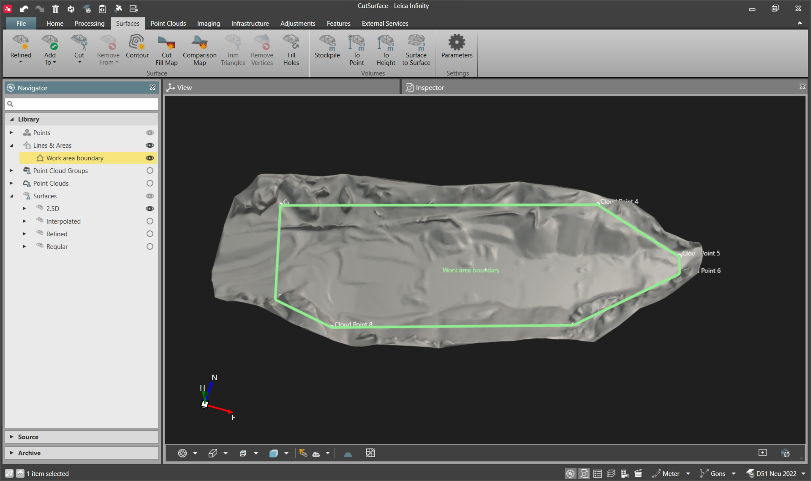
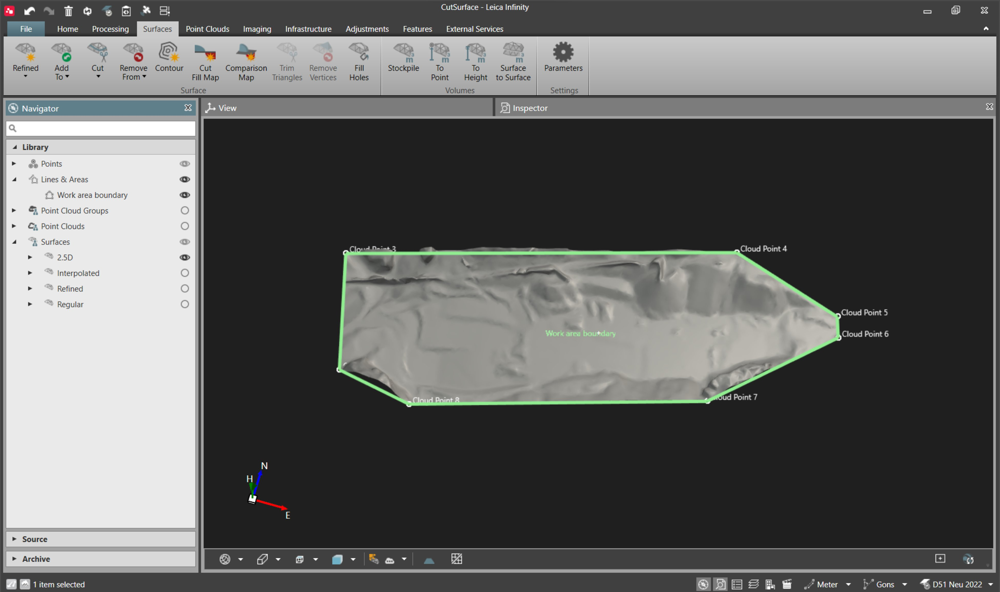

# Cut Surface

### Cut Surface

The cut surface tool enables the cutting of a surface using a chosen closed line/area that is projected to the surface along the H axis. This is different to add to surface where the triangulation is updated to include the closed line/area. The resulting cut is clean and follows the surface morphology.

You have the option to cut based on a boundary or an exclusion area. Cutting with a boundary retains the surface within the selected line/area, whereas cutting with an exclusion area retains the surface outside the chosen feature.

The line/area used to cut the surface is added to the surface itself as a boundary or an exclusion area.

Any closed line/area included in the project (that is not self-intersecting) can be used to cut the surface, also lines that do not have the height coordinate can be used.

It is possible to cut a surface with only one boundary, but many non-overlapping exclusion areas can be used.

It is not possible to cut a surface using multiple features at the same time.

To cut a surface with boundary or exclusion:

**To cut a surface with boundary or exclusion:**

| 1. | In the Inspector, select the    Features tab and select the closed line/area to be used to cut the surface. In the Navigator, lines/areas can be selected from the Library section. Alternatively, you can also select lines/areas in the graphical view. |
| --- | --- |
| 2. | Select    Cut Surface from the Surfaces ribbon bar and select a surface from the drop-down menu.OR:Select   Cut Surface from the context menu and chose an option between   with Boundary or   with Exclusion.OR:Alternatively, select the Surfaces tab and select    Remove from from the ribbon bar to select a surface from the drop-down menu or select    Remove from… from the context menu. |

**Features**

**Cut Surface**

**Cut Surface**

**with Boundary**

**with Exclusion**

**Surfaces**

**Remove from**

**Remove from…**

|  |  |
| --- | --- |

|  |  |
| --- | --- |

