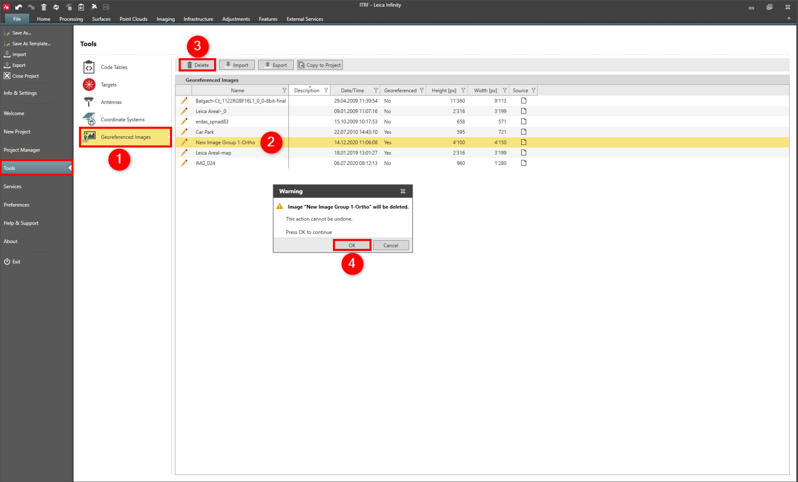

# Delete

### Delete

User-defined or imported georeferenced images can be deleted.

To delete images:

**To delete images:**

|  |  |
| --- | --- |

| 1. | Select File, then Tools and then Georeferenced Images from the menu. |
| --- | --- |
| 2. | Select the image you want to delete. |
| 3. | Select Delete. |
| 4. | Select OK. |

**File**

**Tools**

**Georeferenced Images**

**Delete**

**OK**

