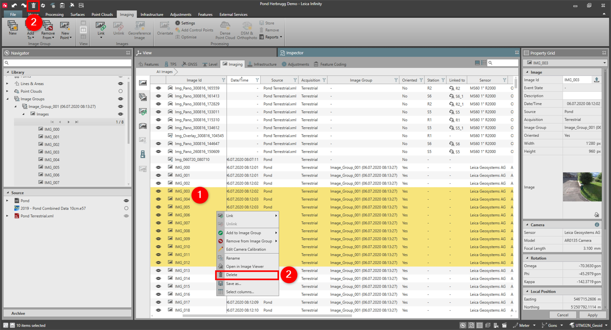

# Delete Images

### Delete Images

To delete images:

**To delete images:**

|  |  |
| --- | --- |

| 1. | Select the images you want to delete, either from the Inspector, the Navigator or the graphical view. |
| --- | --- |
| 2. | Right-click into the selection and select Delete from the context menu or select the Delete option in the top left corner of the main window. |

**Delete**

**Delete**

