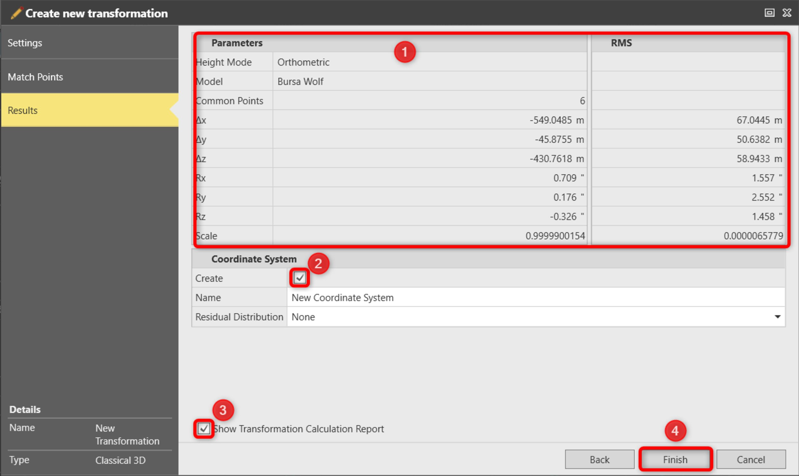

# Determine Transformation: Results

### Determine Transformation: Results

To finalise the calculation:

**To finalise the calculation:**

|  |  |
| --- | --- |

| 1. | Review the calculated transformation Parameters. |
| --- | --- |
| 2. | Select the Create Coordinate System checkbox to create a new coordinate system with the newly calculated transformation. The new coordinate system is available for further usage in the coordinate system manager.Decide on a Residual Distribution. |
| 3. | Deselect the Show Transformation Calculation Report checkbox to hide the report.A report is created by default and opens when you select Finish. |
| 4. | Select Finish to perform the operation. |

**Create**

**Show Transformation Calculation Report**

A report is created by default and opens when you select Finish.

**Finish**

