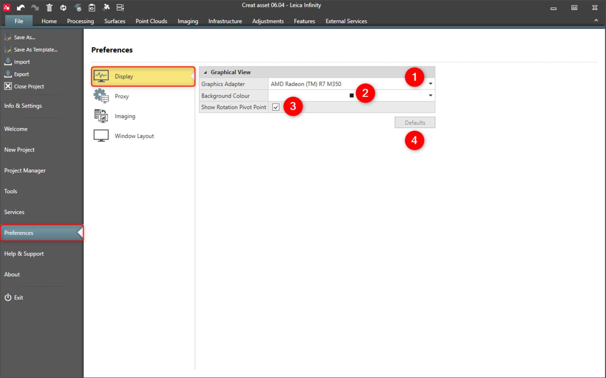

# Display

### Display

Under display, you can configure the graphical view. The settings you make here apply to all projects.

|  |  |
| --- | --- |

| No. | Name | Description |
| --- | --- | --- |
| 1. | Graphics Adapter | Change the graphics adapter if automatic selection is not suitable for you. |
| 2. | Background Colour | Choose a different background colour for the graphical view. |
| 3. | Show Rotation Pivot-Point | Show or hide the pivot-point in the centre of the graphical view. |
| 4. | Defaults | Reset all the settings to the defaults values. |

**Graphics Adapter**

**Background Colour**

**Show Rotation Pivot-Point**

**Defaults**

