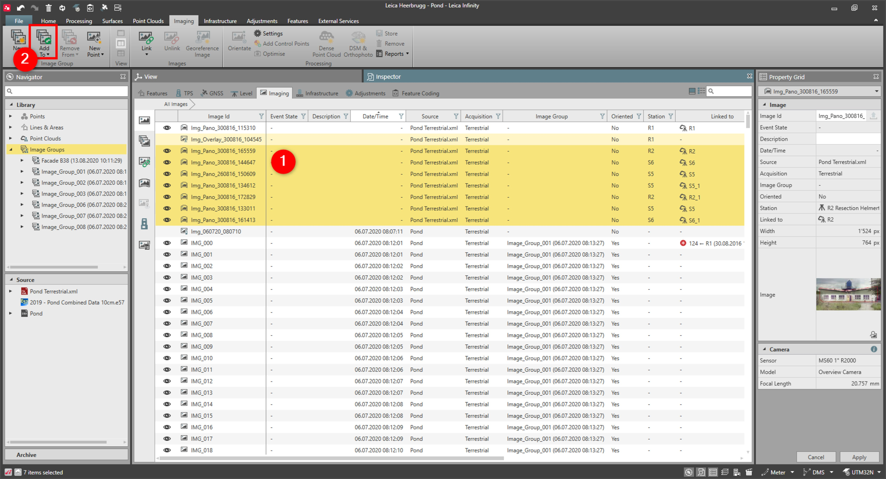

# Add to Image Group

### Add to Image Group

To add images to an image group:

**To add images to an image group:**

|  |  |
| --- | --- |

| 1. | Select the Images to be added either from the Library or the Inspector or the graphical view. |
| --- | --- |
| 2. | Select Add from the Imaging tab or from the context menu. |

**Add**

Images are added to a new image group only if they do not belong to any other image group. Only images acquired from TPS devices can belong to multiple image groups.

