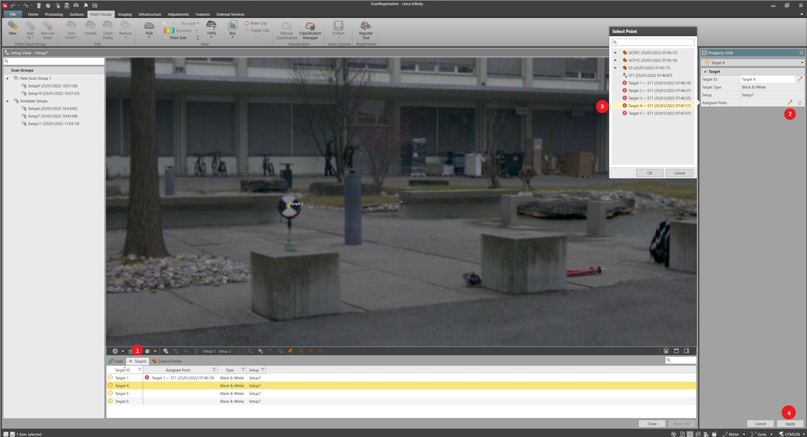

# Applying Control

### Applying Control

Black & white targets extracted at import and targets created after import, can be assigned to Infinity points for translating the scan group on to a coordinate system.

Assign Control to Target

**Assign Control to Target**

Infinity points can be assigned to targets by:

**Infinity points can be assigned to targets by:**

- Selecting an Infinity point using the    option in the Assigned Point field of the targets Property Grid.
- When the Target ID matches the Infinity point ID: Selecting **Auto Assign Control by ID** from the register strip.

|  |  |
| --- | --- |

| 1. | Select the target from the target subtab or from the graphical view. |
| --- | --- |
| 2. | Select the    option in the Property Grid to open the Select Point window with control points from an Infinity project. |
| 3. | From the Select Point window, select the control point to assign to the target. |
| 4. | Select Apply. |

**Apply**

Alternatively, it is possible to assign and apply controls to target, matching the geometry between library points and register targets. From the register strip select the Apply Control Points by Geometry option.

**Apply Control Points by Geometry**

Control points are automatically assigned and applied to the setup. Simultaneously assigned target ID are changed to match those of the control points used.

Max. Target Error in the Point Cloud Registration Settings tab of the File > Info & Settings > Registration tab, is used to allow more freedom when comparing target to library point geometries.

**File**

**Info & Settings**

**Registration**

Apply Control to Scan Group

**Apply Control to Scan Group**

With a minimum of three targets with assigned Infinity points in a scan group, select Apply Control from the register strip. The transformation is computed and relevant error information for each assigned point is reported in the controls subtab of the register tool.

**Apply Control**

GNSS points must have a local position to be assignable.

No scale factor is applied in the apply control process.

