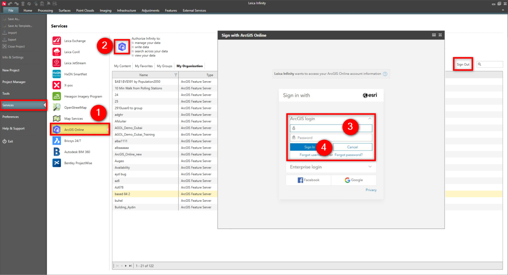

# ArcGIS Online

### ArcGIS Online

Infinity supports the ArcGIS Online service. ArcGIS Online is a cloud-based mapping and analysis solution from ESRI.

You can get access to the feature servers to get data as well as upload existing projects as web maps.

**Requirements:**

- Existing account and valid subscription.

To connect to the ArcGIS Online service:

**To connect to the ArcGIS Online service:**

|  |  |
| --- | --- |

| 1. | Select File, then Services and then ArcGIS Online from the menu. |
| --- | --- |
| 2. | Select ArcGIS Online. |
| 3. | Enter your User Name and Password. |
| 4. | Select Sign In.You are connected until you select to Sign Out. |

**File**

**Services**

**ArcGIS Online**

**ArcGIS Online**

**User Name**

**Password**

**Sign In**

You are connected until you select to Sign Out.

**Sign Out**

When logged in, you can see all supported feature servers grouped as in ArcGIS Online into: My Content > My Favourites > My Groups > My Organisation.

**My Content**

**My Favourites**

**My Groups**

**My Organisation**

Living Atlas from ArcGIS Online is not seen, however selected data can easily be copied to My Favourites or My Groups.

**My Favourites**

**My Groups**

See also:

**See also:**

Get Feature

Save as an ArcGIS Online Web Map

Map Services

The video "Leica Infinity - Services - How to use the ArcGIS Online service"  https://www.youtube.com/watch?v=QgFY17R990o

**"Leica Infinity - Services - How to use the ArcGIS Online service"**

