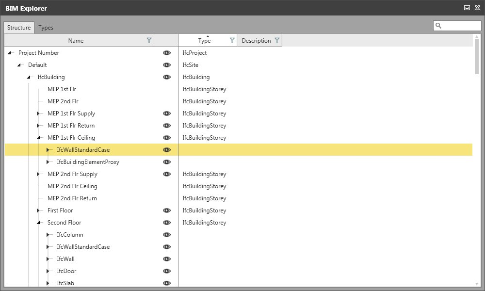
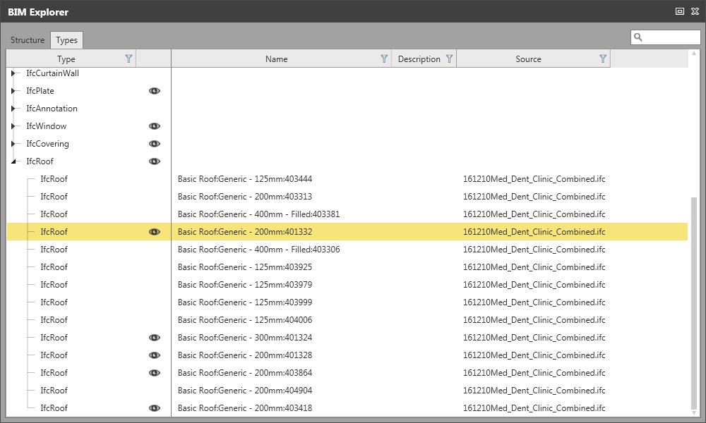

# BIM Explorer

### BIM Explorer

Use the BIM Explorer to inspect the structure of *.ifc files and list its entities by types.

|  |  |
| --- | --- |

To open the BIM Explorer:

**To open the BIM Explorer:**

Select    BIM Explorer from the status bar.

**BIM Explorer**

Available functionality

**Available functionality**

Switching between Structure view and Types view:

**Switching between Structure view and Types view:**

View the elements/entities either by file structure or sorted by type.

|  |  |
| --- | --- |

Selecting elements/entities:

**Selecting elements/entities:**

When you select an element in the BIM Explorer it is simultaneously selected in the graphical view and its properties are displayed in the property grid.

You can select single elements as well as whole entities.

Viewing/Hiding elements/entities:

**Viewing/Hiding elements/entities:**

Select the eye to hide an element or a whole entity from view.

**eye**

Deleting elements:

**Deleting elements:**

Selected elements can be deleted.

Searching for elements/entities:

**Searching for elements/entities:**

Search for single elements or entities.

The Search functionality filters the elements. All other elements are hidden from view.

