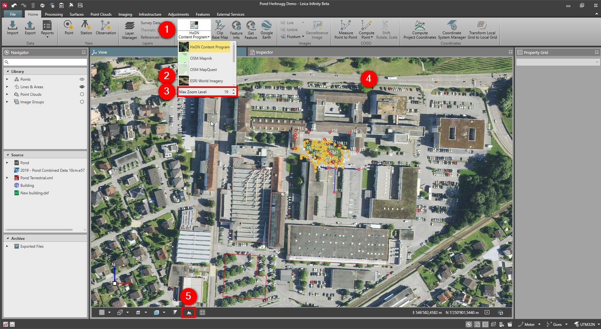

# Base Map

### Base Map

It is possible to use a base map in your project. The base map function is a nice way to help visualise, reference and relate to your project data.

We distinguish between predefined and user-defined base maps.

The following predefined base maps are available:

**The following predefined base maps are available:**

- HxGN Content Program.
- OpenStreetMap.
- ESRI.
- NGS Topo.

**Requirements:**

- A coordinate system defined in the project.
- At least one point in the local grid value available in the project.
- Internet access to stream the image tiles or maps.
- A valid Customer Care Package (CCP) is required to use Leica predefined base maps.
- Manually added services do not require a valid CCP.

The base map is drawn below all project data, regardless of height values.

To enable or disable base map:

**To enable or disable base map:**

|  |  |
| --- | --- |

| 1. | Go to the Home tab and select Toggle Base Map. |
| --- | --- |
| 2. | From the drop-down list, select between the available services. |
| 3. | Define the Max Zoom Level.The default Max Zoom Level is 19 and in normal circumstances should stay in this setting.Higher-quality map services can be viewed in a higher zoom level. The larger the values of the Max Zoom Level, the better the resolution. |
| 4. | The base map is drawn below all project data, regardless of the height values. |
| 5. | Enable the 3D terrain from the graphical view tool bar to view base maps in 3D. |

**Home**

**Toggle Base Map**

The default Max Zoom Level is 19 and in normal circumstances should stay in this setting.

Higher-quality map services can be viewed in a higher zoom level. The larger the values of the Max Zoom Level, the better the resolution.

To add a new map service, see Map Services.

All base maps can be viewed in 3D. Enable the 3D terrain from the graphical view tool bar. The default DEM has a resolution of approximately one arcsecond.

Log in to Earth Data from Services in order to enable the 3D Terrain model option on the view tool bar.

Elevation data is downloaded and shown once the login is established and the 3D Terrain model option is active.

The downloaded elevation data is stored by Infinity in the folder: C:\ProgramData\Leica Geosystems\Infinity\dems\SRTM\version3_0 to be also used in offline mode.

It is possible to add elevation data to the folder manually, to work with the 3D Terrain model offline.

See also:

**See also:**

HxGN Content Program

OpenStreetMap

Map Services

Get Feature

Google Earth

Feature Info

The video "Leica Infinity - Home Module - Using Base Maps" https://www.youtube.com/watch?v=ZPXJSI3WWVM

**"Leica Infinity - Home Module - Using Base Maps"**

