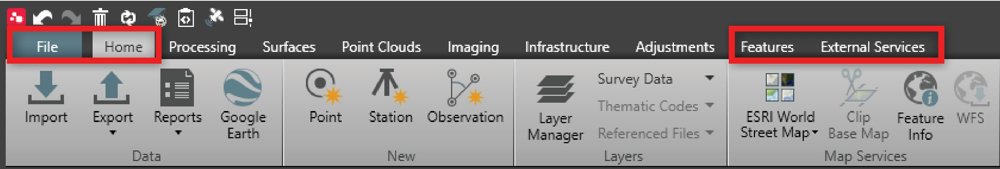

# Basic Modules

### Basic Modules

Basic modules include the core data in and out modules: File, Home, Features and External Services. These modules make for easy field to office or office to field data preparation.

|  |  |
| --- | --- |

File

**File**

- Manage and archive all your Projects.
- Set up local and global settings.
- Send and receive data to and from the field using external services: Leica Exchange, Leica ConX, Autodesk BIM 360.
- Download reference station data from predefined reference stations or by connecting to SmartNet.
- Connect to Map Services: WMS, WMTS, XYZ and WFS.
- Manage and edit coordinate systems.
- Apply styles using the Layer Manager and CodeTables.
- Get Help & Support as well as the access to the Localisation Tool.

Home

**Home**

- Import and export all supported data formats.
- Generate extensive reports including data source and stakeout.
- View or share data using Google Earth.
- View base maps: With an active Customer Care Package (CCP), use the Hexagon Global Network (HxGN) Content Program for accurate orthorectified imagery.
- Check the quality and correcting field errors.
- Use COGO to calculate distance, compute points and shift/rotate/scale.
- Link/unlink images to features, clip base map and georeference image.

Features

**Features**

- Create and edit thematic code information.
- Automated feature code processing (blocks and layer).
- Create and manage points, lines and areas.
- Copy of entities from CAD, IFC, Shape files and WFS to the project.
- Solve name conflicts using the Rename Tool.

External Services

**External Services**

- Send and receive data to cloud services Leica ConX, Leica JetStream and Leica Cyclone Enterprise.

