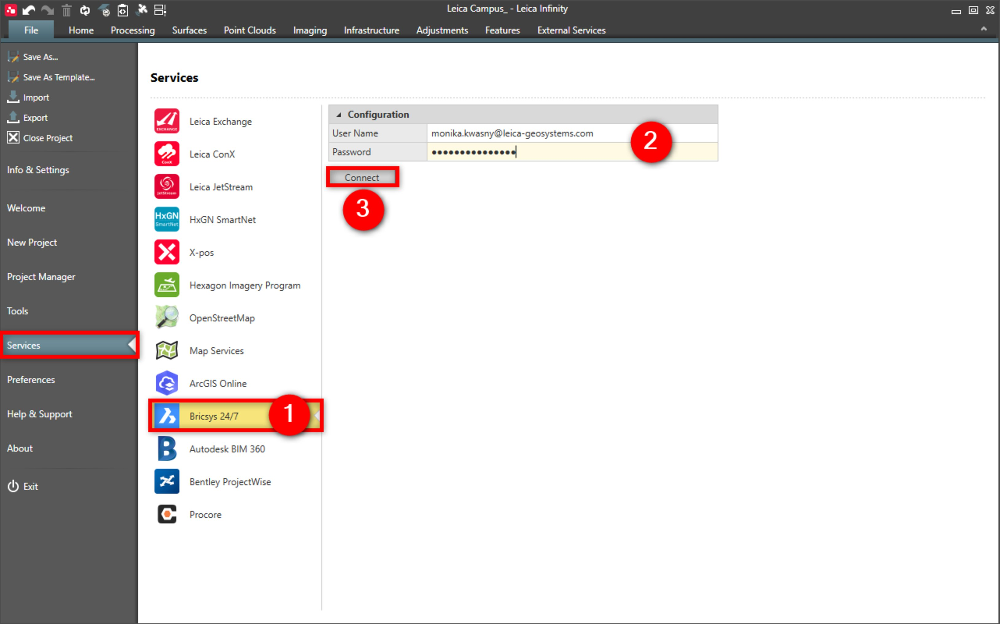

# Bricsys 24/7

### Bricsys 24/7

Infinity supports the Bricsys 24/7 cloud service for sharing project data.

It gives users easy access to their projects and to the data required to prepare for field campaigns.

Being connected also simplifies providing processed data and data deliverables to the project by uploading directly from Infinity.

**Requirements:**

- Valid subscription.

To connect to the Bricsys 24/7 service:

**To connect to the Bricsys 24/7 service:**

|  |  |
| --- | --- |

| 1. | Select File, then Services and then Bricsys 24/7 from the menu. |
| --- | --- |
| 2. | Enter your User Name and Password. |
| 3. | Select Connect. |

**File**

**Services**

**Bricsys 24/7**

**User Name**

**Password**

**Connect**

To import data:

**To import data:**

|  |  |
| --- | --- |

| 1. | Select Import from the Home tab. |
| --- | --- |
| 2. | In the Import window, select Bricsys 24/7. |
| 3. | View the available files in the Bricsys 24/7 window. |
| 4. | Highlight the file to import to the project. |
| 5. | Select Download.The selected file is imported to Infinity and downloaded to the Bricsys 24/7 directory, in the current Infinity project directory. |
| 6. | Select the data and if necessary specify import settings. |
| 7. | Select Import. |

**Import**

**Bricsys 24/7**

**Download**

The selected file is imported to Infinity and downloaded to the Bricsys 24/7 directory, in the current Infinity project directory.

**Import**

To export data:

**To export data:**

|  |  |
| --- | --- |

| 1. | Select Export from the Home tab. |
| --- | --- |
| 2. | In the Export window, select Bricsys 24/7. |
| 3. | From the Bricsys 24/7 window, select the directory to export the data to. |
| 4. | Select the data format and export settings. |
| 5. | Select Export. |

**Export**

**Bricsys 24/7**

**Export**

The Bricsys 24/7 data is always copied to the current Infinity project directory.

