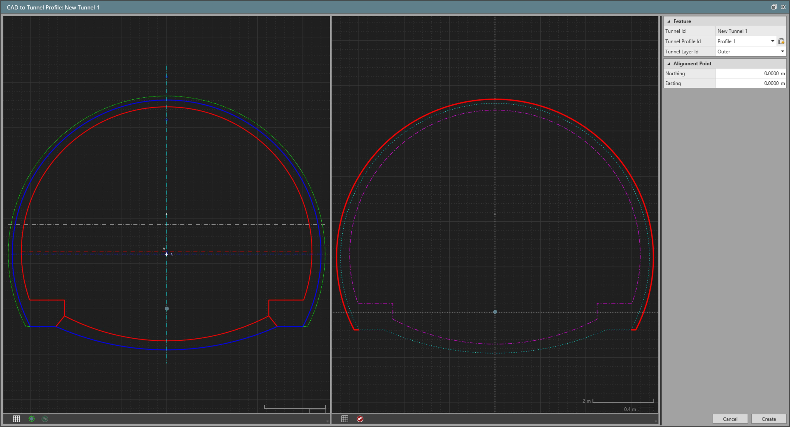
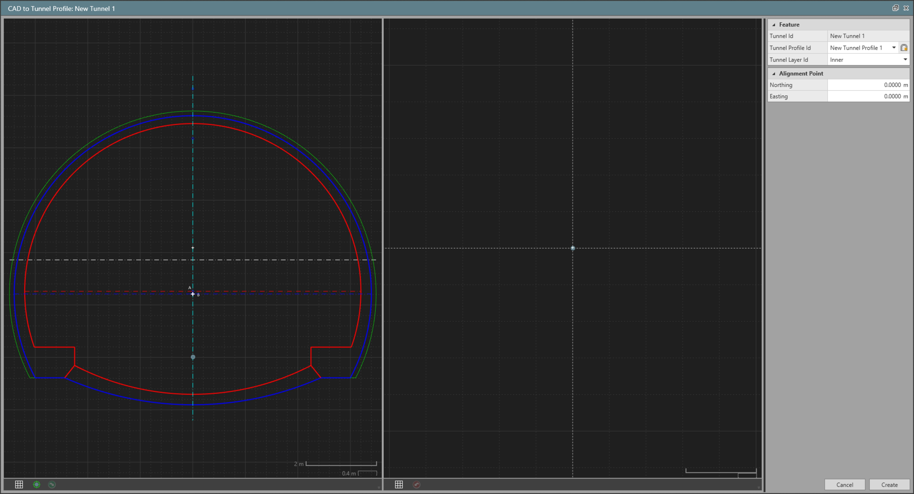
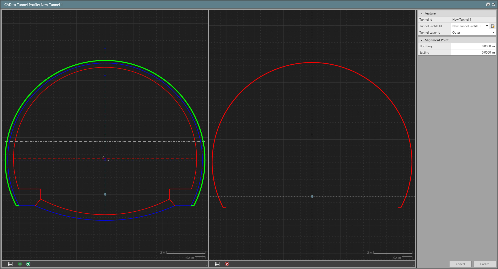
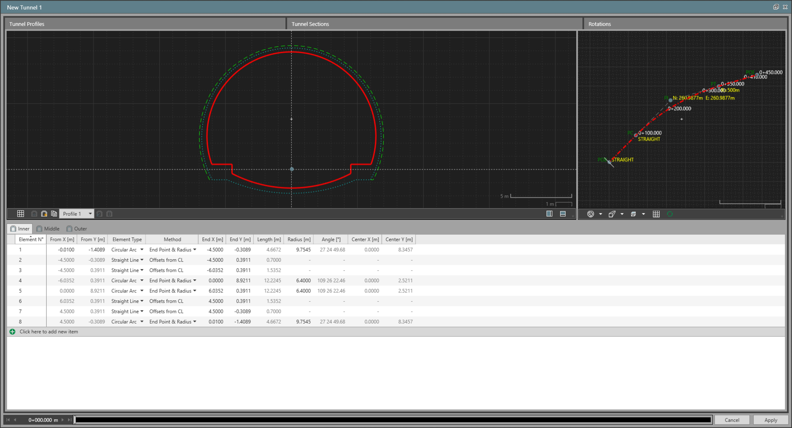

# CAD to Tunnel Profile Tool

### CAD to Tunnel Profile Tool

CAD to tunnel profile is a dedicated tool that allows you to create tunnel profiles from objects imported from CAD files such as dwg, dxf, dgn.

To open the tool, select lines and arcs followed by the tunnel in which the profiles must be created.

By default, the tool opens next to the inspector as a separate page. The view is split in two with the selected objects shown on the left and the converted tunnel profiles on the right.

|  |  |
| --- | --- |

### Select the Objects and Launch the CAD to Tunnel Profile Tool

You can create one or multiple profiles in the CAD to tunnel profile tool. That means, you can select as many objects for as many profiles you have to create before launching the tool.

When you launch the tool, the selected objects are not immediately converted to a tunnel profile. They form a smaller set of data you work with to convert part of the selection to profiles at a later stage.

To open the tool:

| 1. | Select lines and arcs from graphic view that must be converted to tunnel profiles.Only lines, arcs, polylines, points and text from the selection are considered. Other object types are discarded. |
| --- | --- |
| 2. | From the Infrastructure tab in the ribbon, select    CAD to Tunnel Profile. |
| 3. | Select the tunnel where the new tunnel profiles have to be created. Only tunnels with at least a layer are listed. |

Only lines, arcs, polylines, points and text from the selection are considered. Other object types are discarded.

**CAD to Tunnel Profile**

In the CAD to tunnel profile tool, the selected objects are shown in the left view. A new empty profile is created when the tool is launched.

|  |  |
| --- | --- |

### Set the Alignment Point

Each tunnel profile has a point in the cross section view, which corresponds to where the profile is assigned at a given chainage on the alignment. This is referred to as the alignment point.

To set the alignment point, select    from the view strip. You can select the point from the left view or enter its coordinates.

### Copy Objects to Tunnel Profile

Only certain objects are supported to be copied to a tunnel profile. They must:

- Be a line, an arc or a polyline made up of lines and arcs.
- Be on a plane parallel to horizontal. In other words, lines with different heights and arcs in an oblique plane are not supported.

Although points and text are shown in the tool, they are not selectable. Points are there to support setting the alignment point. Text is shown for context.

To copy the objects to a tunnel profile and a tunnel layer:

| 1. | Set the working tunnel profile. |
| --- | --- |
| 2. | Set the working tunnel layer. |
| 3. | Set the alignment point location (only one per profile must be defined). |
| 4. | Select objects on the left that form part of a tunnel profile on the set layer. |
| 5. | Select    Copy to Profile to copy the selected objects. |

**Copy to Profile**

|  |  |
| --- | --- |

The converted profile elements are shown in red on the right. Repeat the previous steps for other tunnel layers.

If the left view looks busy, you can use the layer manager to turn off some reference layers. Ensure that there are no gaps between the objects you select. Gaps can cause unexpected results when copying to profile.

You can create multiple tunnel profiles from CAD objects in the same place. To do so, select    New Tunnel Profile. This sets the new profile as the working profile. Follow the previous steps to add elements to it. You can switch between profiles at any time to review or make changes.

**New Tunnel Profile**

Clear copied elements:

**Clear copied elements:**

To clear the copied elements from a tunnel layer of the working profile, select    Remove all from selected layer. Any elements shown in red on the right for the selected layer are removed from the working profile.

**Remove all from selected layer**

### Create Tunnel Profiles

As you copy objects to tunnel profiles in the tool, the profiles are not immediately saved to the project. Once you are done copying CAD objects to profile elements, select Create to save the tunnel profiles.

**Create**

If the same tunnel is not open in the infrastructure tool, the tunnel profiles are saved directly to the project. If the tunnel is open, the new tunnel profiles are added to the tunnel in the infrastructure tool instead. You can review them and modify as needed. Select Apply in the Infrastructure Tool to save the profiles to the project.

|  |  |
| --- | --- |

Reset CAD to tunnel profiles tool:

**Reset CAD to tunnel profiles tool:**

If you want to discard all the changes made in the CAD to tunnel profile tool, select Cancel.

**Cancel**

The CAD objects on the left remain unaffected.

