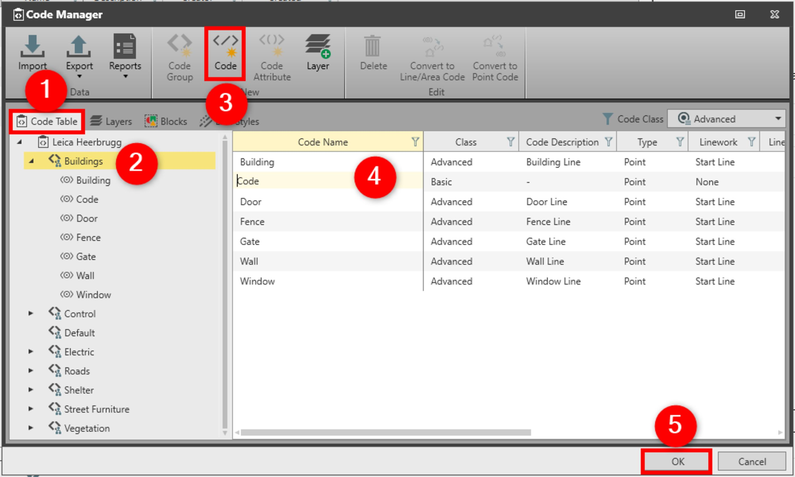

# Code

### Code

Codes are parts of code groups and are used to describe objects. A set of codes with a common theme is grouped into a code group. For example, the codes tree, hedge and grass, may be attached to a code group entitled vegetation.

There are two methods for feature coding:

**There are two methods for feature coding:**

| Name | Description |
| --- | --- |
| Thematical codes | Can be assigned to points, lines and areas. |
| Free codes | Purely time-related information recorded in-between measurements in the field. A timestamp is recorded with each free code allowing a chronological order of export points and free codes to be used for third-party mapping software. |

To add a new code to the code group:

**To add a new code to the code group:**

|  |  |
| --- | --- |

| 1. | In the Code Manager, select the Code Table tab. |
| --- | --- |
| 2. | Select the code group to which you want to add a new code in the navigator view. |
| 3. | Select Code from the ribbon bar |
| 4. | In the content area, a new code line is created with default settings that you can modify.In the Attributes, you can see how many attributes the code has. |
| 5. | Select OK to save the changes and to close the Code Manager. |

**Code Table**

**Code**

In the Attributes, you can see how many attributes the code has.

**OK**

A code consists of:

**A code consists of:**

| Group Name | Name | Description |
| --- | --- | --- |
| Coding Information | Code Name | May be up to 16 characters long and may consist of numbers or alphanumeric characters (for example tree). |
| Code Description | May be up to 16 characters long and may consist of alphanumerical characters (for example outstanding tree).The description of a code is optional.For Leica Captivate V2.30 and higher, the allowed length is 48 characters when ASCII characters are used. If other than ASCII characters are used, then it depends on the character set whether longer names are truncated on export.Codelists and jobs with names longer than 16 characters cannot be imported to any Infinity version lower than 2.4. |
| Type | Can either be point, line, area or free. |
| Quick Code | Must be unique within a code table and up to three alphanumeric characters are allowed.To define a quick code is optional. |
| Linework | Is only available for codes type point and it can be either none, start line or start area. |
| Coding Style Information | Layer | Enables grouping of codes by theme. For example, the codes kerb, canter line and pavement can be grouped in the same layer called road. |
| Style Option | Can be either by layer or by code. This option allows you to set if the code uses its own style in the project or uses the style from the layer.For example, the codes kerb and pavement (type line) can use different colours. Both can be assigned to the same layer called road. When you select the by code option, they are presented in the project with their own colour. When you select the by layer option they are presented with the same colour defined for layer road.This option is not available for free codes.By code is not available for the point code if linework is set to none. |
| Block | Geometry objects used to represent features. For example, a CAD block represents a tree or a signpost. |
| Line Colour | Is available for code types point/linework (start line/start area), line, area. |
| Line Width | Is available for code types point/linework (start line/start area), line, area. |
| Line Style | Is available for code types point/linework (start line/start area), line, area. |
| Shading Colour | Is available for code types point/linework (start area), area layer. |

**Coding Information**

The description of a code is optional.

For Leica Captivate V2.30 and higher, the allowed length is 48 characters when ASCII characters are used. If other than ASCII characters are used, then it depends on the character set whether longer names are truncated on export.

Codelists and jobs with names longer than 16 characters cannot be imported to any Infinity version lower than 2.4.

To define a quick code is optional.

**Coding Style Information**

This option is not available for free codes.

By code is not available for the point code if linework is set to none.

There is no limitation for the number of codes. You can add new codes, modify existing codes and delete codes within a code group.

Each code may have attributes attached to it. Attributes prompt you to enter further information about the code.

See also:

**See also:**

Code Tables

The video "Leica Infinity - Feature Coding Part 1 - How to create a Code Table & Codelist" https://www.youtube.com/watch?v=9Mf8E0trTXA

**"Leica Infinity - Feature Coding Part 1 - How to create a Code Table & Codelist"**

The video "Leica Infinity - Feature Coding Part 4 - How to process features and export to CAD" https://www.youtube.com/watch?v=ASLoVHHAYGQ

**"Leica Infinity - Feature Coding Part 4 - How to process features and export to CAD"**

