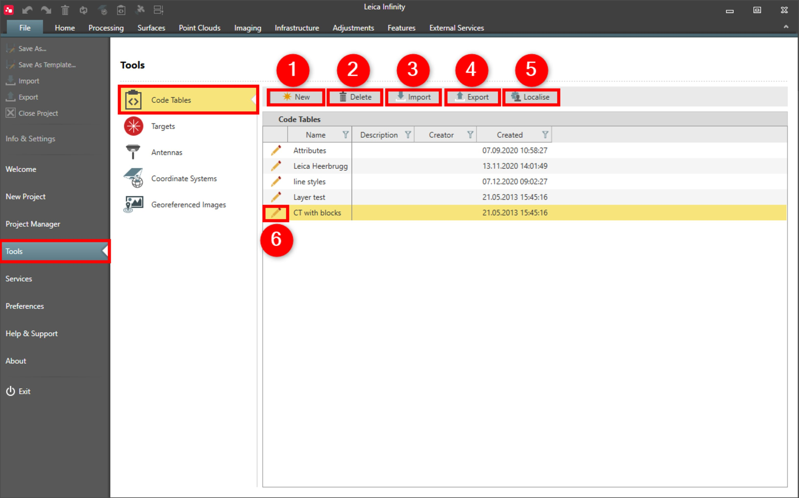

# Code Tables

### Code Tables

The code table is to manage the list of code groups, codes, attributes and styling information including layers, blocks and custom line styles.

A codelist can be generated in the code table and transferred to the field software. When measurements are made, the details of the features like codes and attributes, are recorded and stored with the measured point. Everything can be considered a feature, a building, a fence, a road, a bench, or even a tree.

The code table applies automatically the correct style to the imported field data.

Use feature coding to help increase productivity both in the field and the office by:

**Use feature coding to help increase productivity both in the field and the office by:**

- Having features described.
- Visualising the data in the software.
- Simplified CAD export.

In code tables you can do the following:

**In code tables you can do the following:**

|  |  |
| --- | --- |

| No. | Name | Description |
| --- | --- | --- |
| 1. | New | Create a new code table. |
| 2. | Delete | Delete an existing code table, including existing codes and attributes.There is no undo function. |
| 3. | Import | Import an Infinity code table from an *.lic file.To import a codelist from Leica field software, a new Infinity code table must first be created and edited it in the Code Manager. |
| 4. | Export | Export an Infinity code table to an *. lic file.A code table, can be exported as a codelist to Leica field software, from inside the Code Manager. |
| 5. | Localise | Open the Localisation Tool and download code tables from the available global or national list. |
| 6. | Edit | Open the Code Manager to add/edit codes and its attributes as well as layers, line styles and blocks. |

**New**

**Delete**

There is no undo function.

**Import**

To import a codelist from Leica field software, a new Infinity code table must first be created and edited it in the Code Manager.

**Export**

A code table, can be exported as a codelist to Leica field software, from inside the Code Manager.

**Localise**

**Edit**

See also:

**See also:**

Code Manager

The video "Leica Infinity – Feature Coding Part 1 - How to create a Code Table & Codelist" https://www.youtube.com/watch?v=9Mf8E0trTXA

**"Leica Infinity – Feature Coding Part 1 - How to create a Code Table & Codelist"**

The video "Leica Infinity – Feature Coding Part 2 - How to use blocks and layers" https://www.youtube.com/watch?v=REYP8JzmaSs

**"Leica Infinity – Feature Coding Part 2 - How to use blocks and layers"**

The video "Leica Infinity – Feature Coding Part 3 - How to use custom line styles" https://www.youtube.com/watch?v=ze9ganVf6AU

**"Leica Infinity – Feature Coding Part 3 - How to use custom line styles"**

The video "Leica Infinity – Feature Coding Part 4 - How to process features and export to CAD" https://www.youtube.com/watch?v=ASLoVHHAYGQ

**"Leica Infinity – Feature Coding Part 4 - How to process features and export to CAD"**

