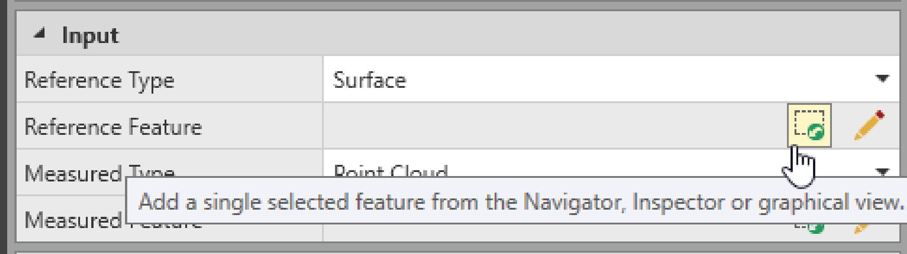
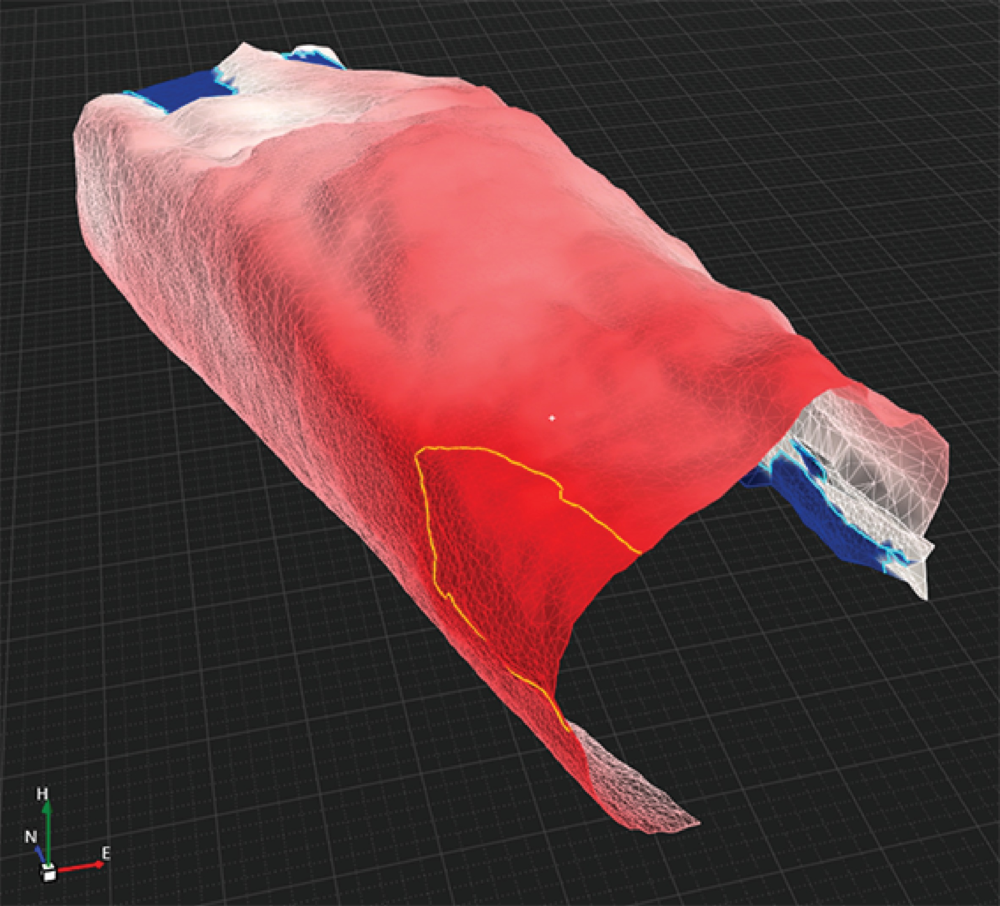
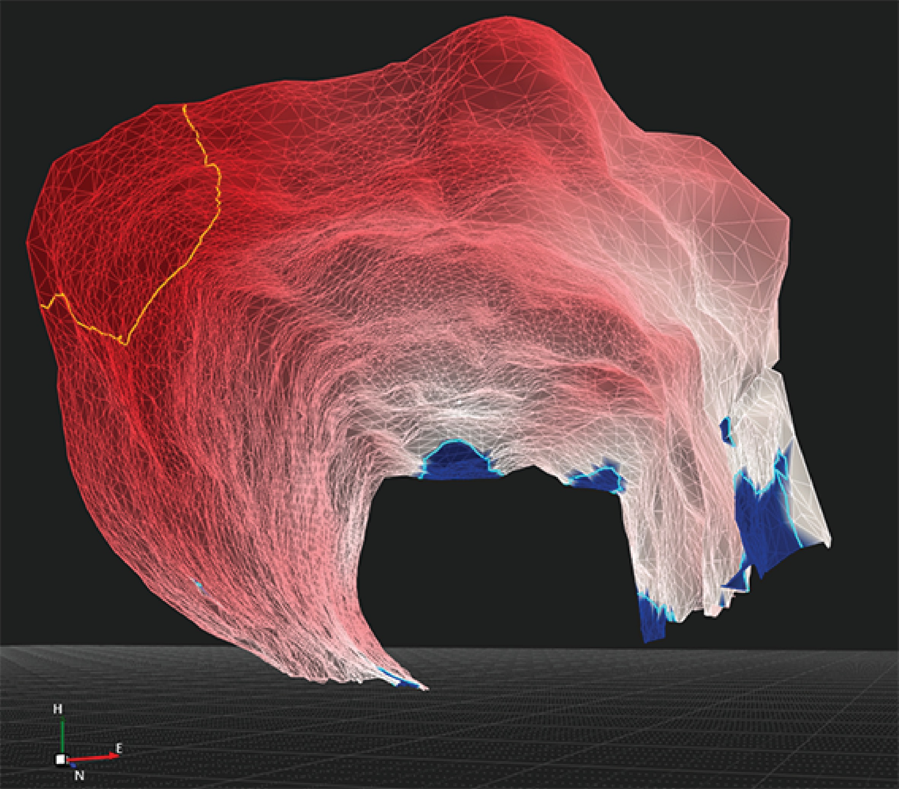
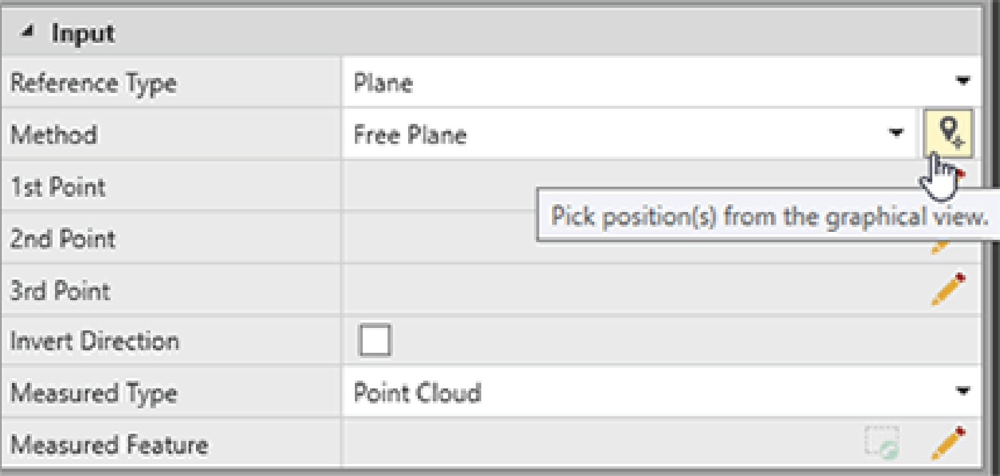
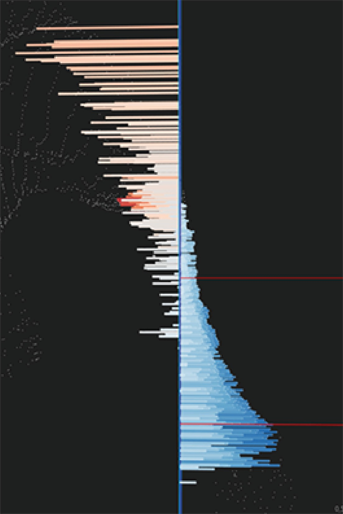
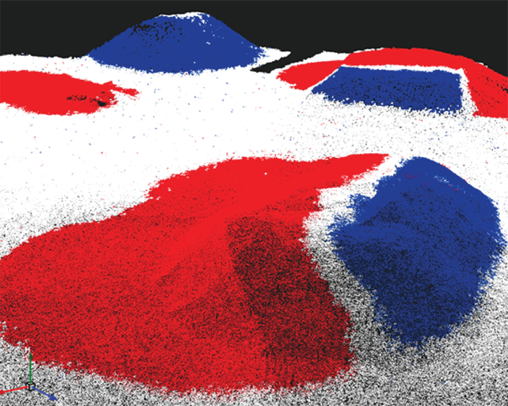

# Comparison Maps

### Comparison Maps

Comparison maps is a surfaces function that allows the comparison of a reference feature with a measured feature. The differences are displayed in the graphical view, as well as in the property grid of the calculated comparison map.

Reference features can be:

**Reference features can be:**

- A surface.
- One point cloud.

Measured type must be point cloud/group as well.

- A point cloud group.

Measured type must be point cloud/group as well.

- A plane:Horizontal.Vertical.Free.
- Horizontal.
- Vertical.
- Free.
- One or more Industry Foundation Classes (IFC) objects (solids).
- An area.
- A closed line.

- Horizontal.
- Vertical.
- Free.

Measured features can be:

**Measured features can be:**

- A surface.
- One or more point clouds.
- A point cloud group.
- One or more library points.

Differences can be calculated along the height axis or in 3D, perpendicular to the reference object.

The differences are then colour-coded and shown in a so called comparison map. The comparison map is saved to the database as a Infinity object. By default, it shows in blue volumes, distances and areas that are above the reference feature. Volumes, distances and areas that are below, are indicated in red.

The settings can be changed any time before and after the creation of the map in the Styling settings.

How to calculate a comparison map:

**How to calculate a comparison map:**

| 1. | Go to the Surface tab and select Comparison Map from the Surfaces ribbon bar.The Create New Comparison Map window opens up next to the regular property grid. |
| --- | --- |
| 2. | Select the Reference Type you want to compare against (design). Once set, you can choose the feature itself.Not every feature allows a multiple selection.The selection can be done using a pencil flyout or by selecting the Add current selection option. In order to use it, select the required features from the Navigator, Inspector or graphical view, before selecting the option. |  |
| 3. | Select the Measured Type that represents the captured data. Afterwards, choose the required measured features in the same way as the required reference features.The order of adding the data is not relevant.For library points, it is also possible to select multiple points within the pencil flyout. Deselecting points can be done by keeping the Ctrl key pressed and a left-click of the mouse. |
| 4. | Under Settings, you can choose to compute only differences or check your data against tolerances.If you select tolerances, specify the upper and lower tolerance values and define a minimum segment distance. Through the segment distance value, you can simplify the tolerance lines.Tolerance lines indicate the areas in the map where material has to be added or removed. These lines can be exported for stakeout, but if they are too detailed the controller might not be able to handle them. |
| 5. | Also under the Settings, you can specify the inspection direction - If you want to calculate distances along the height axis or perpendicular to the reference feature. Then the direction is variable and depends on the shape of the reference feature. |
| 6. | If the data set you are comparing has large extends, you can limit the range by activating the ignore distances larger than option. Define the maximum distance between the reference and the measured feature.You can also limit point clouds by clipping data or performing a manual selection in the graphical view. |
| 7. | Under Styling, define which colours shall be used for indicating above/below values.Default values for Settings and Styling can be defined in the surfaces Parameters option.Select Parameters from the Surfaces ribbon bar to open.These settings are shared with the cut fill map. |
| 8. | Select the Create option to create the new comparison map.A new comparison map object is created and visible in the graphical view, as well as the Navigator, Inspector and Property Grid. |

**Surface**

**Comparison Map**

Not every feature allows a multiple selection.

The selection can be done using a pencil flyout or by selecting the Add current selection option. In order to use it, select the required features from the Navigator, Inspector or graphical view, before selecting the option.

**Add current selection**

The order of adding the data is not relevant.

For library points, it is also possible to select multiple points within the pencil flyout. Deselecting points can be done by keeping the Ctrl key pressed and a left-click of the mouse.

Tolerance lines indicate the areas in the map where material has to be added or removed. These lines can be exported for stakeout, but if they are too detailed the controller might not be able to handle them.

You can also limit point clouds by clipping data or performing a manual selection in the graphical view.

Default values for Settings and Styling can be defined in the surfaces Parameters option.

**Parameters**

These settings are shared with the cut fill map.

**Create**

|  |  |
| --- | --- |

Comparison map tolerance mode results including tolerance lines at 0 difference (cyan lines) and -2m difference (orange line):

**Comparison map tolerance mode results including tolerance lines at 0 difference (cyan lines) and -2m difference (orange line):**

|  |  |
| --- | --- |
|  |  |

Using Point Cloud as Reference

**Using Point Cloud as Reference**

One reference point cloud or group can only be compared to other point clouds or groups. Comparing the same point cloud with itself or a part of it is not allowed.

Inspection Direction set to Along Height Axis: Infinity displays values below (negative) and above (positive) the reference point cloud/group.

The comparison map might have a low point density, when the reference or measured point cloud is dense in some areas and sparse in other areas. In this case, the result can be improved, if the measured point cloud is windowed in the graphical view.

Inspection Direction set to Perpendicular: Infinity displays absolute distances between the two-point clouds/groups. All distances are positive, independent of being above or below the reference.

Using Planes as Reference Features

**Using Planes as Reference Features**

There are different methods of creating a plane:

**There are different methods of creating a plane:**

- Horizontal: Select a height of a point or enter a height yourself. The inspection direction is fixed along the height axis.
- Vertical: Select two points to define the vertical plane. The inspection direction is fixed to the perpendicular.
- Free: Select three points to define a 3D plane.

Points can be chosen from the flyout or directly from the graphical view. The plane is created only once all required points are selected. It is possible to edit the plane as often as you like, until you select the create option.

|  |  |
| --- | --- |

The inspection direction can be inverted with the checkbox. You can define which values shall be positive or negative.

After the creation of the comparison map, the plane also appears in the graphical view and navigator. You can turn it off by using the visibility eye or switching off the comparison map reference planes layer from the layer manager.

Inspecting the Comparison Results

**Inspecting the Comparison Results**

Depending on the measured feature selected, you see the distances in the graphical view in the shape of a surface, point cloud or lines (library points).

In the Property Grid select the    option to see a histogram of the calculation results.

To generate a report, on one or multiple comparison maps, select the maps in the Navigator or the Inspector and either select: Reports > Comparison Map Report from the Home ribbon bar or right-click and select Comparison Map Report.

**Reports**

**Comparison Map Report**

**Comparison Map Report**

For best viewing in the graphical view, it is recommended to turn off the visibility of the measured and reference feature. This allows to focus on the comparison map itself.

If you choose a plane as a reference, then you can also turn off its visibility from the navigator.

In the Layer Manager, you can change the width of the lines for the representation of distances between a reference feature and library points.

Measured Type = Library Points:

**Measured Type = Library Points:**

|  |  |
| --- | --- |

Measured Type = Point Cloud:

**Measured Type = Point Cloud:**

|  |  |
| --- | --- |

