# Compute Point

### Compute Point

Compute point is one of the COGO functions and can be used:

**Compute point is one of the COGO functions and can be used:**

- To determine point positions relative to existing geometry objects, like base points and offset points.
- To determine point positions by intersection or segmentation of existing geometry objects.
- To determine point positions by defining a direction and distance from a known point.

The following methods are supported:

**The following methods are supported:**

| Icon | Method | Illustration | Description |
| --- | --- | --- | --- |
|  | Bearing Bearing |  | Calculates the intersection point between two selected points using defined bearings. |
|  | Bearing Distance |  | Calculates the intersection points between two selected points using a defined bearing from one point and a defined distance from the other. |
|  | Distance Distance |  | Calculates the intersection points between two selected points using defined distances. |
|  | Point in Direction |  | Calculates a point using a defined direction and distance from a known point. |
|  | Two Observations |  | Calculates the intersection point between two selected TPS observations. |
|  | Line Base Point |  | Calculates the position of a base point on a defined line where the offset to a defined point is perpendicular to the line. |
|  | Line Intersection |  | Calculates the intersection point between two defined lines. |
|  | Line Offset Point |  | Calculates the position of an offset point using an entered distance along and a perpendicular offset from a defined line. |
|  | Line Segmentation |  | Splits a line into multiple segments. The segment length is derived from either a given number of segments or a specified segment length. |
|  | Arc Base Point |  | Calculates the position of a base point on a defined arc where the offset to a defined point is perpendicular to the arc. |
|  | Arc Offset Point |  | Calculates the position of an offset point using an entered distance along and a perpendicular offset from a defined arc. |
|  | Arc Segmentation |  | Splits an arc into multiple segments. The segment length is  derived from either a required number of segments or a specified segment length. |

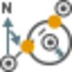

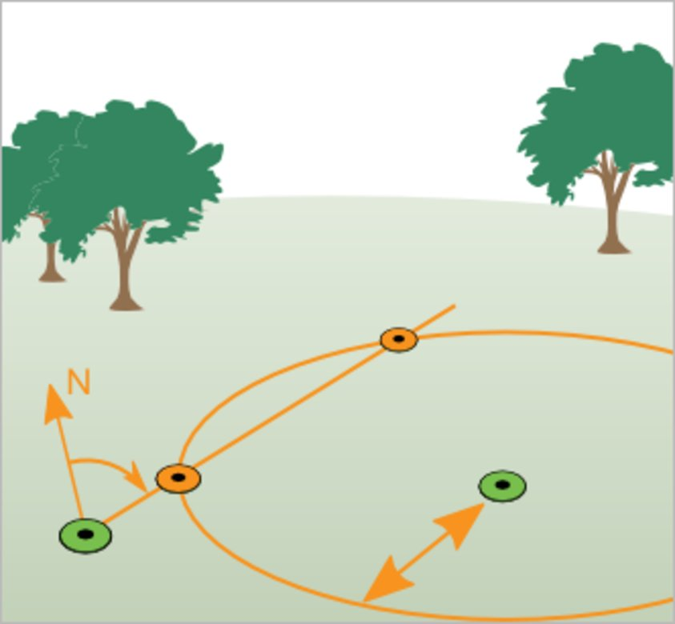

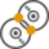

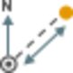

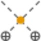

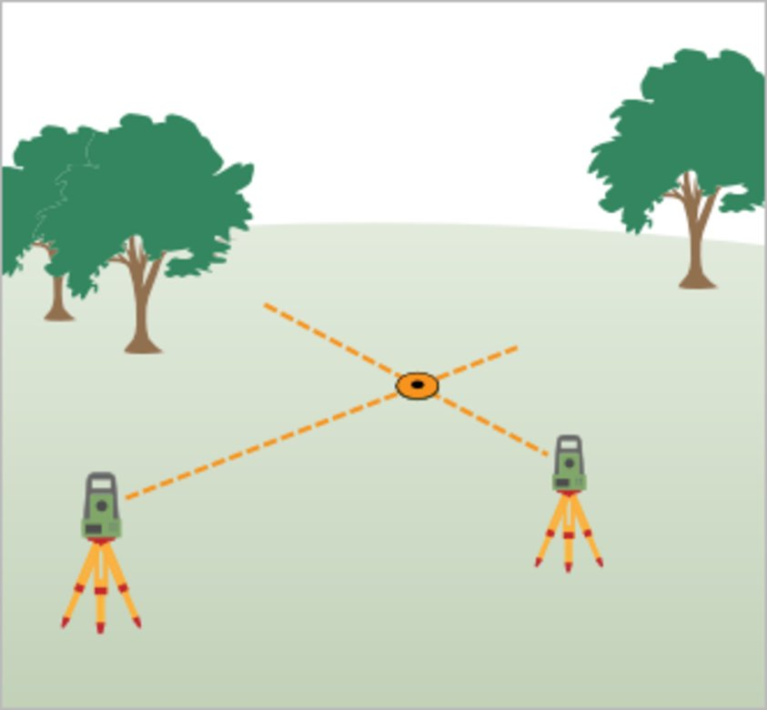

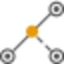

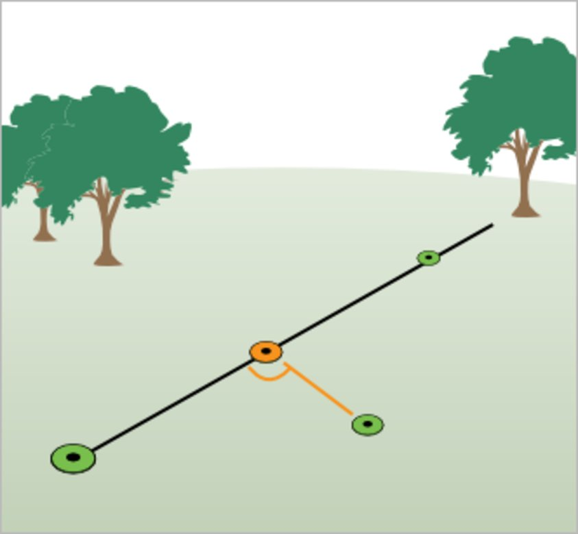

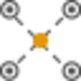

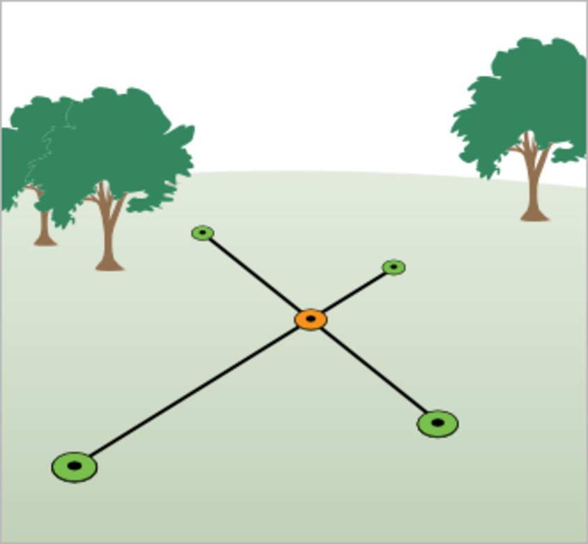

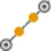

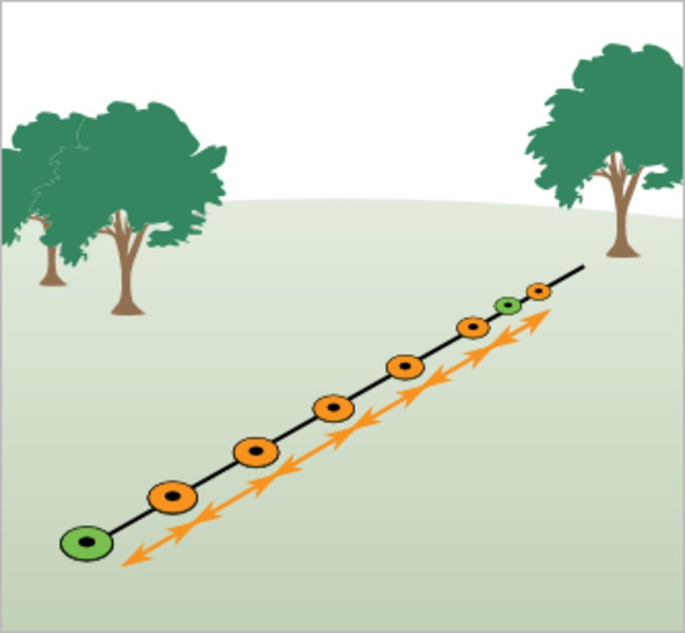

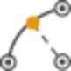

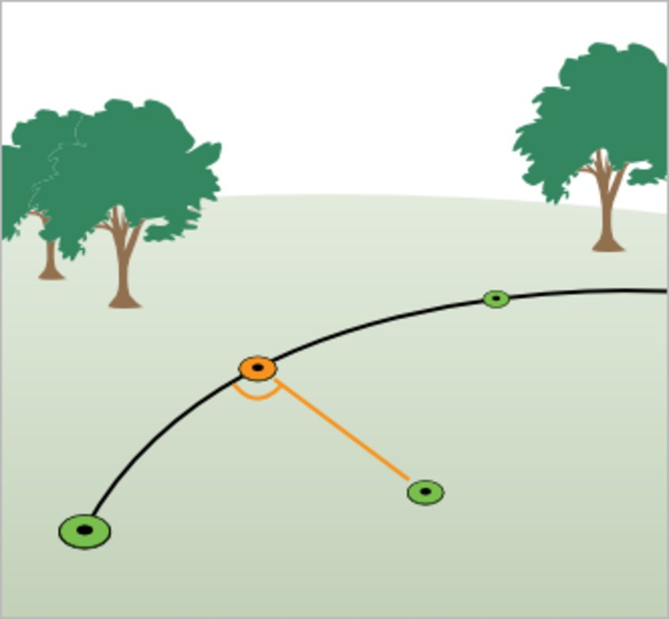

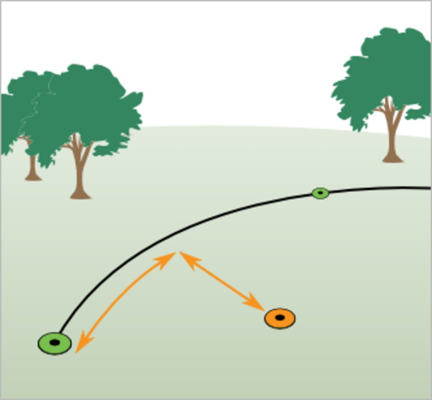

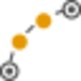

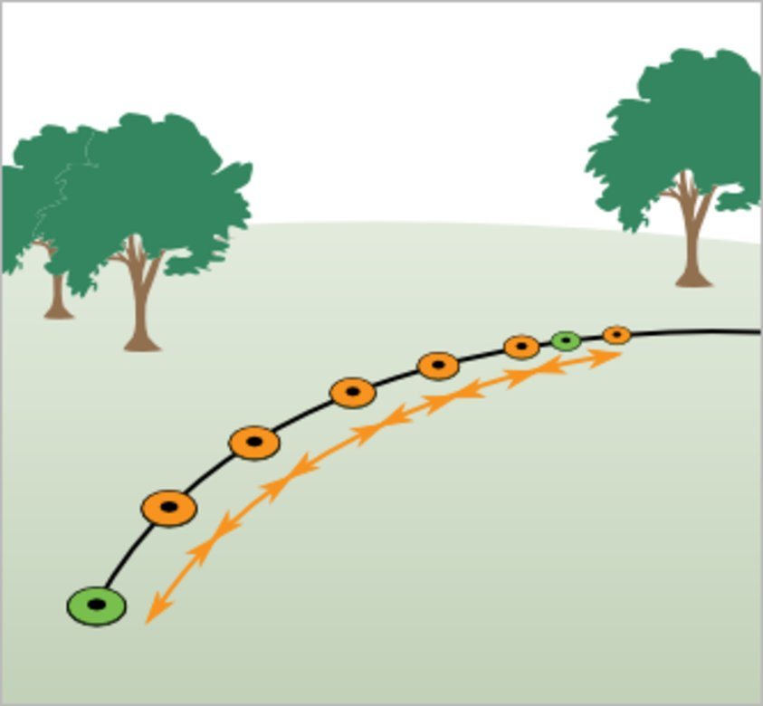

### How to Compute Points?

| 1. | Go to COGO > Compute Point in the Home tab and select a method from the drop-down menu.The Compute Point Property Grid opens up next to the regular Property Grid.You can still change the method here.For some methods, it is necessary to select how the geometry shall be defined.Select a Mode from the drop-down box. |
| --- | --- |
| 2. | Select    the points and/or observations based on which the computation shall be performed. You can only select existing Infinity objects as input to the computation.Objects can also be selected graphically in the graphical view.To select observations, TPS observations have to visible in the graphical view. See also Layer Manager.If you cancel the operation or if you have already run a computation and want to run another, then select Measure at the bottom of the Property Grid to activate point selection again in the graphical view. |
| 3. | Depending on the calculation method, you may need or want to define azimuths, distances or offsets.Enter the values or select the    option to calculate the values.For methods Bearing Bearing, Bearing Distance and Distance Distance the values can also be derived from selecting points graphically for computation. |
| 4. | Select the Height at which the computed points shall be calculated. You have the choice between:NoneNo height is computed.MaxThe point is computed at the same height as the point with the maximum height, that has been used for computation.MinThe point is computed at the same height as the point with the minimum height, that has been used for computation.AverageThe point is computed at an average height of all points that have been used for computation. |
| 5. | Check the box for Show report, when you need a report of the COGO computation. |
| 6. | The Result of the computation is shown in the Property Grid once all necessary input is available.In the Results panel, you can change the Point Role and Coding information of the computed point.If more than one point results from the computation (for example in the case of Distance Distance computations) select which of the points shall be saved. |
| 7. | Select Create to save the computed points as objects to the project database.If selected before, the COGO report opens automatically. |
| 8. | Computed COGO points are selectable.A flyout displays the method and values used to compute the COGO point. In the properties, select    in Local Position. |

**COGO**

**Compute Point**

You can still change the method here.

For some methods, it is necessary to select how the geometry shall be defined.

Select a Mode from the drop-down box.

If you cancel the operation or if you have already run a computation and want to run another, then select Measure at the bottom of the Property Grid to activate point selection again in the graphical view.

**Measure**

For methods Bearing Bearing, Bearing Distance and Distance Distance the values can also be derived from selecting points graphically for computation.

**None**

**Max**

**Min**

**Average**

**Show report**

If more than one point results from the computation (for example in the case of Distance Distance computations) select which of the points shall be saved.

**Create**

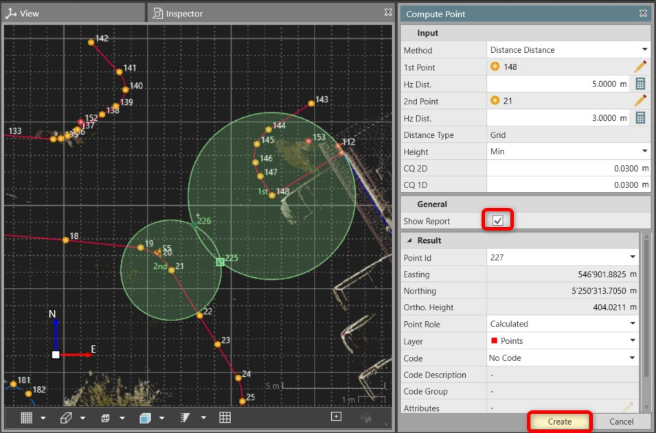

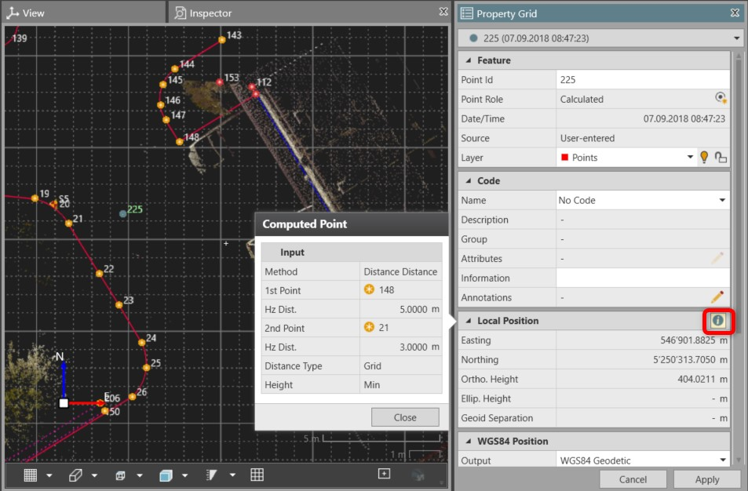

