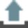

# Coordinate System Properties

### Coordinate System Properties

To view and edit the coordinate system properties:

**To view and edit the coordinate system properties:**

Go to the Coordinate Systems tab of the inspector and select a coordinate system from the list.

**Coordinate Systems**

In the property grid:

**In the property grid:**

| Select the    Export to Global option if you want to make the selected coordinate system be globally available under File > Tools > Coordinate Systems.The option is inactive if the selected coordinate system is already available under File > Tools > Coordinate Systems.Select the    icon to get detailed information on the transformation, ellipsoid and projection used with the coordinate system in a fly-out.Select the    icon to get detailed information on the geoid model or the CSCS model used with the coordinate system. Import a geoid or CSCS model if required or select a different one from the drop-down list.Only Geoid/CSCS models that are valid for the selected coordinate system are available for selection. Their names can be modified if required.Leave the Property Grid with Apply to take over your changes. |
| --- |

- Select the    **Export to Global** option if you want to make the selected coordinate system be globally available under File > Tools > Coordinate Systems.

The option is inactive if the selected coordinate system is already available under File > Tools > Coordinate Systems.

**File**

**Tools**

**Coordinate Systems**

- Select the    icon to get detailed information on the transformation, ellipsoid and projection used with the coordinate system in a fly-out.
- Select the    icon to get detailed information on the geoid model or the CSCS model used with the coordinate system. Import a geoid or CSCS model if required or select a different one from the drop-down list.

Only Geoid/CSCS models that are valid for the selected coordinate system are available for selection. Their names can be modified if required.

- Leave the **Property Grid** with Apply to take over your changes.

To import Geoid/CSCS Model:

**To import Geoid/CSCS Model:**

In the Geoid/CSCS Model fly-out:

**In the Geoid/CSCS Model fly-out:**

| 1. | Select the    option to browse for and select a geoid model (*.gem) or a CSCS model (*.csc). Their names can be modified. |
| --- | --- |
| 2. | Leave the fly-out with OK to add the geoid/CSCS model to the drop-down list. |
| 3. | The newly imported model is selected automatically. Select None if you want no geoid or CSCS model to be used with the coordinate system. |
| 4. | Leave the fly-out with OK to apply your modifications. The inspector view is updated accordingly. |

**OK**

**None**

**OK**

Only Geoid/CSCS models that are valid for the selected coordinate system can be imported.

