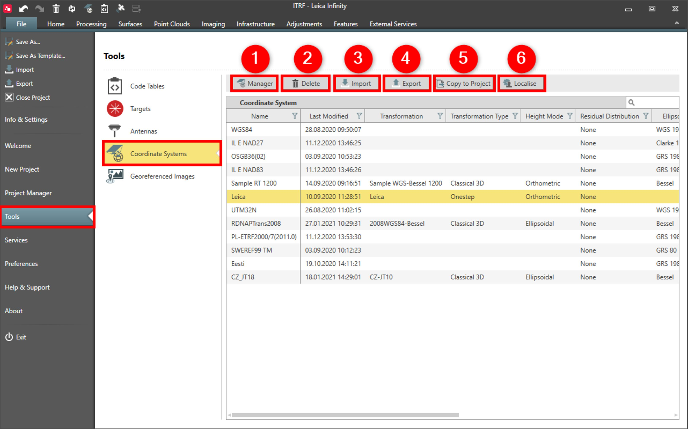

# Coordinate Systems

### Coordinate Systems

The globally available coordinate systems are listed by name together with their source and information on the transformation and residual distribution, the ellipsoid and projection and the geoid and CSCS model used with each coordinate system.

Here you can do the following:

**Here you can do the following:**

|  |  |
| --- | --- |

| No. | Name | Description |
| --- | --- | --- |
| 1. | Manager | Opens the Coordinate System Manager, where geoid models, CSCS models and the whole coordinate systems can be imported, created and managed. |
| 2. | Delete | Permanently delete the selected coordinate system.There is no undo function. |
| 3. | Import | Import existing coordinate systems from:SmartWorx DBX (*.xcf).*.dat files.iCON/SBG Geo *.lok.Infinity Coordinate System file*.CSYS.HeXML/LandXML.LGO CSys *.dbd.Trimble *.DC/*.CAL/*.JXL. |
| 4. | Export | Export coordinates systems as Infinity coordinate system files in:*.csys.Global Transformation Sets TRFSET.dat files.iCON/SBG Geo *.lok.Trimble *.DC/*.CAL/*.JXL. |
| 5. | Copy to Project | Copy selected coordinate system to the currently open project.You can only copy coordinate systems to the project which are not attached already. |
| 6. | Localise | Open the Localisation Tool and download coordinate systems from the available global or national list. |

**Manager**

**Delete**

There is no undo function.

**Import**

- SmartWorx DBX (*.xcf).
- *.dat files.
- iCON/SBG Geo *.lok.
- Infinity Coordinate System file*.CSYS.
- HeXML/LandXML.
- LGO CSys *.dbd.
- Trimble *.DC/*.CAL/*.JXL.

**Export**

- *.csys.
- Global Transformation Sets TRFSET.dat files.
- iCON/SBG Geo *.lok.
- Trimble *.DC/*.CAL/*.JXL.

**Copy to Project**

You can only copy coordinate systems to the project which are not attached already.

**Localise**

See also:

**See also:**

Coordinate System Manager

Local and Global Data Objects

