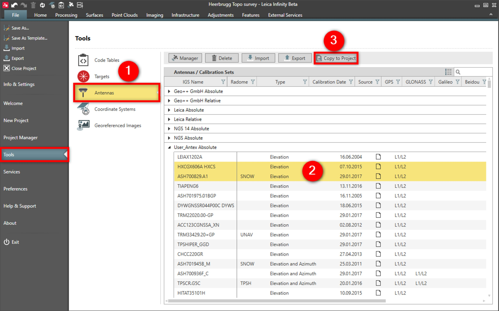

# Copy to Project

### Copy to Project

Antennas are automatically mapped during import of GNSS data to the project. When the GNSS antenna is found in the global tools antenna list, then all antenna calibration definitions are copied into the project automatically.

Antennas can be copied from the global tools into single projects to make them available in calibration sets for processing.

To copy antennas to a project:

**To copy antennas to a project:**

|  |  |
| --- | --- |

| 1. | Select File , then Tools and then Antennas from the menu. |
| --- | --- |
| 2. | Select the antennas you want to copy. |
| 3. | Select Copy to Project. |

**File**

**Tools**

**Antennas**

**Copy to Project**

See also:

**See also:**

Local and Global Data Objects

