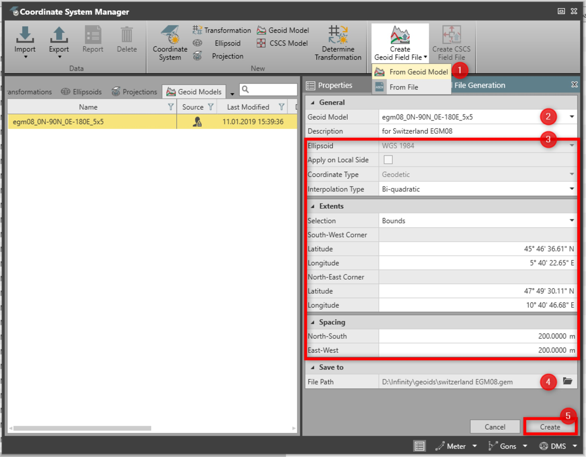
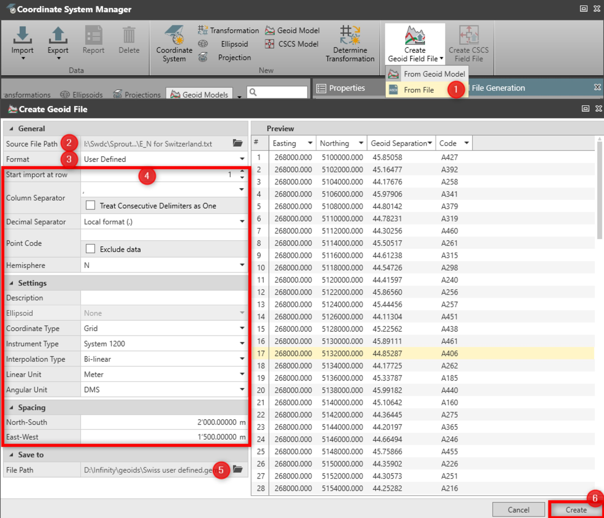

# Create Geoid Model

### Create Geoid Model

Geoid models may also be used on the receiver in the field. This command enables you to create a geoid model.

Geoid models usually consist of a geoid height grid where a geoid separation is defined for each grid point. Depending on the extent and the grid spacing of the geoid model, it may require considerable disk space. In order to use the geoid model on a GPS sensor the disk space has to be reduced and a special file has to be created which allows the field system to interpolate geoid separations.

From geoid model:

**From geoid model:**

This command enables you to extract a geoid height grid from an existing geoid model for a particular area. The area boundary can be defined by a rectangle or circle and a grid spacing in metres can be selected. The file can then be uploaded to the receiver.

|  |  |
| --- | --- |

| 1. | From the Coordinate System Manager, select Create Geoid Model/From File. |
| --- | --- |
| 2. | Select an existing geoid model from the list.If Select source file is selected from the list, browse to the existing .exe file.If the tool has been started from a project, the list with all geoids found in the project are shown.If the tool has been started from the File tab, all available geoids are shown. |
| 3. | Define all needed settings. |
| 4. | From the file browser, select the path where the file shall be created (enter a file name without extension). |
| 5. | Select Create to finish the process. |

**Coordinate System Manager**

**Create Geoid Model/From File**

**Select source file**

If the tool has been started from a project, the list with all geoids found in the project are shown.

If the tool has been started from the File tab, all available geoids are shown.

**Create**

From File:

**From File:**

You can create a geoid GEM file from locally provided geoid model data usually in ASCII format.

|  |  |
| --- | --- |

| 1. | From the Coordinate System Manager, select Create Geoid Model/From File. |
| --- | --- |
| 2. | Browse for an ASCII grid file. |
| 3. | Select the Format.Select between User Defined or some Predefined formats. |
| 4. | Define all needed settings.When a predefined format is selected, the settings are filled in automatically. |
| 5. | From the file browser, select the path where the file shall be created.Enter a file name without extension. |
| 6. | In the preview, identify the data type in each column by selecting a type from each drop-down menu.Select Create to finish the process. |

**Coordinate System Manager**

**Create Geoid Model/From File**

**User Defined**

**Predefined formats**

When a predefined format is selected, the settings are filled in automatically.

**Create**

Once created, the geoid model is automatically added to the list of geoids in the Coordinate System Manager.

