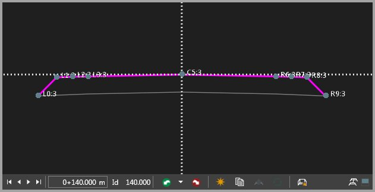
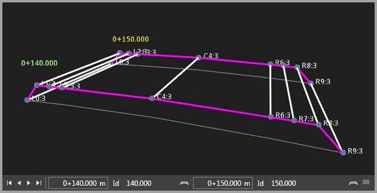
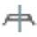
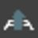

# Cross Section Assignments

### Cross Section Assignments

In the cross sections tab of the infrastructure manager, you can switch between    editing cross sections and    editing connections.

Edit cross section view:

**Edit cross section view:**

|  |  |
| --- | --- |

Edit connections view:

**Edit connections view:**

|  |  |
| --- | --- |

Each cross section is shown as a vertical cut through the road layers at a specific station/chainage.

The inspector view has as many tabs as material layers are defined. The layer of the active tab is colour indicated in the graphical representation of the cross section.

Each of the nodes that constitute a cross section is defined with offsets to the left and the right of the centreline. The centreline is available on all layers.

To create a new cross section assignment:

**To create a new cross section assignment:**

| 1. | Shift the slider to the position in the chainage bar where a cross section shall be assigned to or enter the chainage value. |
| --- | --- |
| 2. | Select    New Template to create a new cross section template or select    Add to and select a template from the list. |
| 3. | Select Apply in the Infrastructure Manager. |

**New Template**

**Add to**

**Apply**

The template is assigned as a cross section to the selected chainage and assume as its ID the current chainage value. Existing cross sections in the position are overwritten.

In the navigator and the road inspector the cross section assignment is added to the list.

Assignments can be deleted. The template remains.

Changes you have made to an assigned cross section are lost when the template has not been updated before.

To edit an assigned cross section:

**To edit an assigned cross section:**

| 1. | Shift the slider upon a cross section in the chainage bar or enter its chainage value. |
| --- | --- |
| 2. | Edit the offsets and/or side slopes of single nodes or add new nodes in the Inspector view. The graphical view follows your changes.To add new nodes right-click and select Add Above or Add Below from the context menu.If you design a cross section from scratch and you know that left and right side shall be identical, then you can create the right or the left side and press the    Mirror button to automatically create the nodes on the other side.It only works when one side is empty. |
| 3. | If a template has been used, optionally    update your changes to the template for further use.Assignments that have come in with your road data on import do not have underlying templates.Copy them to a new template when you want to save your changes.Assignments using a modified template are not automatically updated.Reassign the updated template when necessary. |
| 4. | Select Apply. |

**Add Above**

**Add Below**

If you design a cross section from scratch and you know that left and right side shall be identical, then you can create the right or the left side and press the    Mirror button to automatically create the nodes on the other side.

It only works when one side is empty.

Assignments that have come in with your road data on import do not have underlying templates.

Copy them to a new template when you want to save your changes.

Assignments using a modified template are not automatically updated.

Reassign the updated template when necessary.

**Apply**

To create a copy of an assigned cross section:

**To create a copy of an assigned cross section:**

| 1. | Shift the slider upon the cross section that shall be copied or enter its chainage value. |
| --- | --- |
| 2. | Select    Copy to New Cross Section Template.Next to the Property Grid the New Cross Section Template tab opens up. |
| 3. | Shift the slider to the position in the chainage bar where the cross section shall be copied to or enter the chainage value. |
| 4. | Select Create in the New Cross Section Template tab.The template ID can be modified. |
| 5. | Select Apply in the Infrastructure Manager. |

**Copy to New Cross Section Template**

**Create**

**Apply**

The copy of the previously selected assignment is created and assigned to the selected chainage. Existing cross sections in the position are overwritten.

The template is available for future use.

To extract a cross section to a new cross section template:

**To extract a cross section to a new cross section template:**

Cross sections can be extracted from a transition area by interpolating all its nodes from the stringlines between the two existing cross sections.

| 1. | Shift the slider to the position in the chainage bar where the new cross section shall be interpolated or enter the chainage value. |
| --- | --- |
| 2. | Select    Extract to New Cross Section Template.Next to the Property Grid the New Cross Section Template tab opens up. |
| 3. | Select Create in the New Cross Section Template tab.The new cross section is interpolated at the selected chainage. |
| 4. | Select Apply in the Infrastructure Manager to assign the new cross section.The template is available for future use. |

**Extract to New Cross Section Template**

**Create**

**Apply**

How to edit connections?

**How to edit connections?**

To fix problems found within road design data using cross sections:

**To fix problems found within road design data using cross sections:**

| 1. | Switch to the Edit Connections view. |
| --- | --- |
| 2. | Shift the slider in the chainage bar to the cross section for which you want to edit connections.The graphical view shows the selected cross section and the following one.The Inspector splits to show the details of both cross sections. |
| 3. | In the Inspector select the elements to be connected in both cross section profiles and then    Link from the context menu or from the Infrastructure > Road Design ribbon bar.To disconnect elements select them both and then    Unlink. |

**Link**

**Infrastructure**

**Road Design**

**Unlink**

The stringline is recalculated and redrawn in the graphical view.

