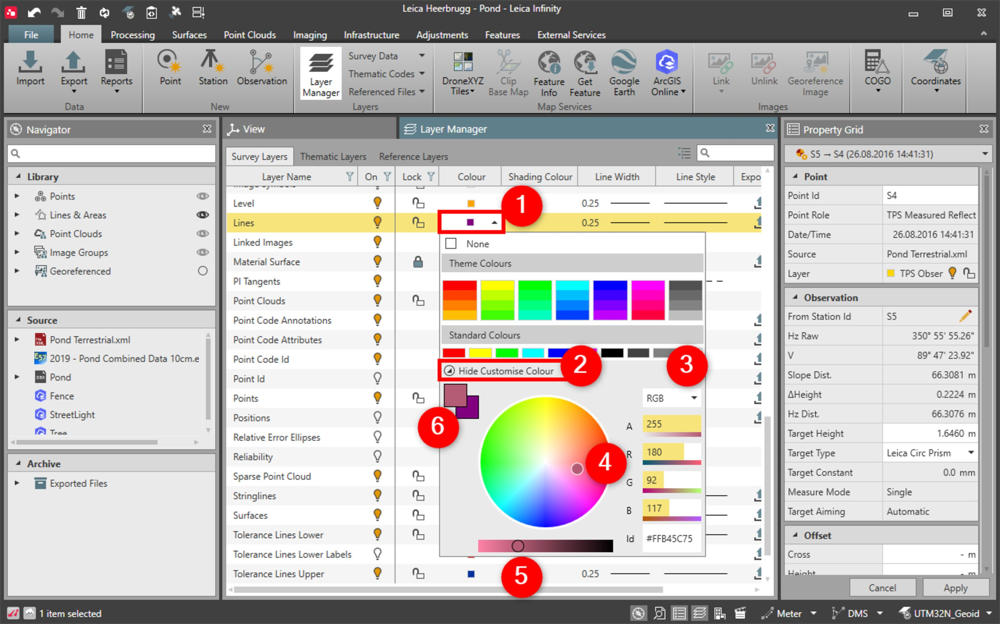

# Customising Colours

### Customising Colours

Code and layer colours can be customised.

To customise a colour:

**To customise a colour:**

|  |  |
| --- | --- |

| 1. | Select Home, then Layer Manager and select the object to be customised. |
| --- | --- |
| 2. | From the drop-down menu, select Show Customise Colour. |
| 3. | You can choose between RGB (Red-Green-Blue) colour definitions or HSB (Hue-Saturation-Brightness) from the drop-down list. |
| 4. | Drag the inner circle to the area of the desired colour spectrum.You can also enter the ID of a specific colour or its RGB/HSB parts. |
| 5. | Move the circle in the bar at the bottom to change the brightness. |
| 6. | Set the selected colour by selecting the square in the top left corner of the customisation area. |

**Home**

**Layer Manager**

**Show Customise Colour**

**RGB**

**HSB**

You can also enter the ID of a specific colour or its RGB/HSB parts.

