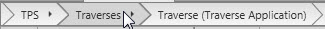

# Data Inspector

### Data Inspector

The data inspector shows module-specific project content grouped thematically for detailed investigation. It is designed to focus completely on one type of data object.

The availability of the module-specific tabs depends on which of the modules you have decided to purchase.

See also:

**See also:**

License Options

With the options on the left side, you can switch between subcategories.

|  |  |
| --- | --- |

If you have closed the inspector you can make it reappear by selecting the    Inspector option in the status bar.

**Inspector**

Functions

**Functions**

Drilling down:

**Drilling down:**

To get one step further into your data select the arrow    next to a group of data items.

Navigation to parent:

**Navigation to parent:**

To navigate back to a higher category of data items, select the breadcrumbs.

Example:

Filtering:

**Filtering:**

To filter points and other objects by their ID or date and time, use the search function.

To filter columns, select the    option in the column header. To undo the filter effect, click the option again and clear your selection.

Editing:

**Editing:**

To edit the properties of an item, select it and make your edits in the property grid.

Where ever the    option is available a separate tool for editing can be invoked.

Multi-Edit is possible for points and observations. For further information, refer to the following topics:

Observation Properties

Multi-Editing of Point Code Information

Recovering Points/Observations:

**Recovering Points/Observations:**

Points and/or observations deleted in the field can be restored by selecting    Recover from the context menu.

**Recover**

Selecting Columns/Changing Column Order:

**Selecting Columns/Changing Column Order:**

Right-click onto a column header or any item in the inspector view and select    Select columns... from the context menu.

**Select columns...**

Select the columns to be visible and change the column order if desired.

You can also change the column order by dragging and dropping the column header.

Sorting by Column Heading:

**Sorting by Column Heading:**

Click onto the header of a column to sort its items in an ascending or descending order.

By default, the items in the inspector view are sorted by the first column.

If tilt compensation was applied to a measurement using the Leica AP20 sensor, tilt compensated measurement values are shown in the data inspector.

