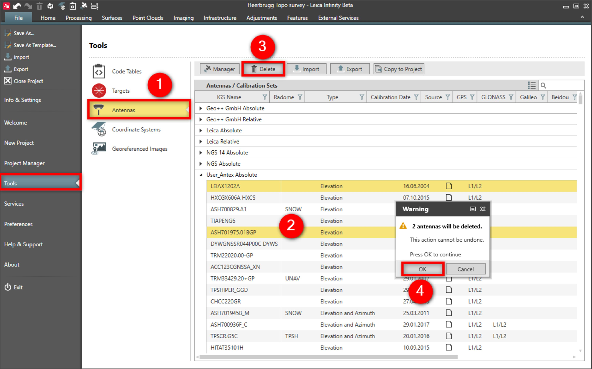

# Delete

### Delete

User-defined or imported antennas/calibration sets can be deleted.

The following actions can also be done from within the GNSS Manager.

To delete antennas:

**To delete antennas:**

|  |  |
| --- | --- |

| 1. | Select File, then Tools and then Antennas from the menu. |
| --- | --- |
| 2. | Select the antenna file you want to delete. |
| 3. | Select Delete. |
| 4. | Select OK. |

**File**

**Tools**

**Antennas**

**Delete**

**OK**

