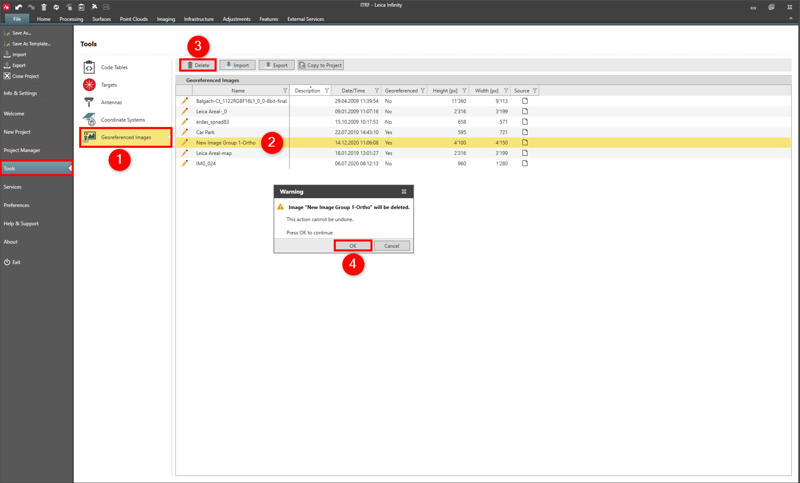

# Delete

### Delete

To delete a map service:

**To delete a map service:**

|  |  |
| --- | --- |

| 1. | Select File, then Services and then Map Services from the menu. |
| --- | --- |
| 2. | Select the map service you want to delete from the list. |
| 3. | Select Delete from the ribbon bar or context menu. |
| 4. | Select OK. |

**File**

**Services**

**Map Services**

**Delete**

**OK**

See also:

**See also:**

Get Feature

Base Map

The video "Leica Infinity - Services - How to use the ArcGIS Online service" https://www.youtube.com/watch?v=QgFY17R990o

**"Leica Infinity - Services - How to use the ArcGIS Online service"**

