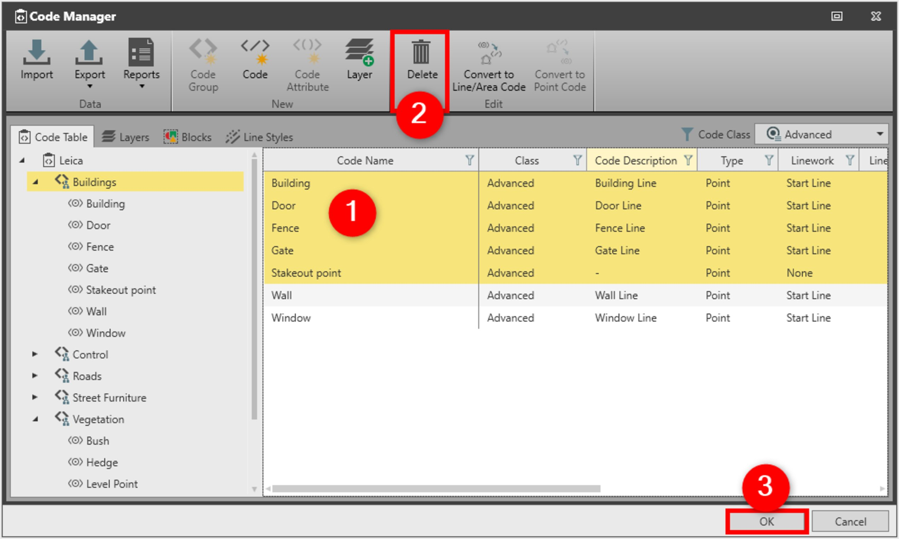

# Delete

### Delete

In the Code Manager It is possible to delete the following objects:

**In the Code Manager It is possible to delete the following objects:**

- Code Groups
- Codes
- Attributes
- Layers
- Blocks
- Line Styles

To delete an object from code manager:

**To delete an object from code manager:**

|  |  |
| --- | --- |

| 1. | In the Code Manager, select the objects from either the Code Table, Layers, Blocks or the Line Styles tabs |
| --- | --- |
| 2. | Select Delete. |
| 3. | Select OK to save the changes and to close the Code Manager. |

**Code Table**

**Layers**

**Blocks**

**Line Styles**

**Delete**

**OK**

If you delete a code group, all codes and attributes in that code group are deleted.

If you delete a code, all attributes of that code are deleted.

See also:

**See also:**

Code Tables

The video "Leica Infinity - Feature Coding Part 1 - How to create a Code Table & Codelist" https://www.youtube.com/watch?v=9Mf8E0trTXA

**"Leica Infinity - Feature Coding Part 1 - How to create a Code Table & Codelist"**

The video "Leica Infinity - Feature Coding Part 4 - How to process features and export to CAD" https://www.youtube.com/watch?v=ASLoVHHAYGQ

**"Leica Infinity - Feature Coding Part 4 - How to process features and export to CAD"**

