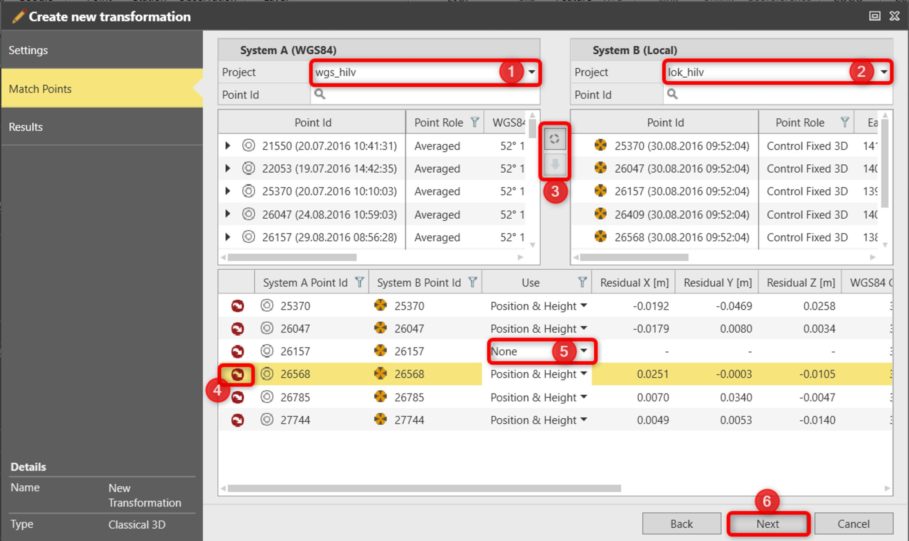

# Determine Transformation: Match Points

### Determine Transformation: Match Points

To match common points:

**To match common points:**

|  |  |
| --- | --- |

| 1. | Select a project to load the list of points for System A (WGS84).Only points stored in the project as WGS84 are shown. |
| --- | --- |
| 2. | Select a project to load the list of points for System B (Local).Only points stored in the project as local grid are shown. |
|  | Points can be loaded into the list for System A (WGS84) and System B (Local) separately by selecting an Infinity project. These can be two different projects, but you can also select the same project for A and B. |
| 3. | Match points: |
|  | Match the points manually:Available only for the single selection.Select a point in System A (WGS84) then select a point in System B (Local).Select the option to make a pair. |
|  | Match the points automatically:Available if nothing is selected or if at least one point which has a match is selected.The match looks for the same point ID from selected points and makes pairs automatically.Pairs always use the highest point roles. |
|  | To unselect a point press Ctrl+click. |
| 4. | : When selected, the pair is removed from the list. The calculation is updated based on remaining pairs. |
| 5. | Select the Use: Position & Height, Position, Height or None.None removes matched common points from the transformation calculation but does not delete them from the list. This option can be used to help improve residuals.For classic 3D, only Position & Height or None are available. |
| 6. | Select Next to proceed with Step 3: Determine Transformation: Results. |

Only points stored in the project as WGS84 are shown.

Only points stored in the project as local grid are shown.

Points can be loaded into the list for System A (WGS84) and System B (Local) separately by selecting an Infinity project. These can be two different projects, but you can also select the same project for A and B.

**Match the points manually:**

**Match the points automatically:**

**Use**

None removes matched common points from the transformation calculation but does not delete them from the list. This option can be used to help improve residuals.

For classic 3D, only Position & Height or None are available.

**Next**

