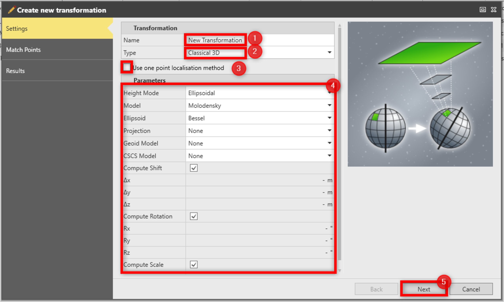

# Determine Transformation: Settings

### Determine Transformation: Settings

To define the settings:

**To define the settings:**

|  |  |
| --- | --- |

| 1. | Enter the transformation Name. |
| --- | --- |
| 2. | Select the transformation Type from the drop-down list: Classic 3D, Onestep or Twostep. |
| 3. | If you want to use a one point localisation, check the option Use one point localisation method. |
| 4. | Depending on the selected Type, choose the Parameters.You can enter the parameters for shift, rotation and scale manually or allow Infinity to compute them using common points. |
| 5. | Select Next to proceed with Step 2: Determine Transformation: Match Points. |

**Use one point localisation method**

You can enter the parameters for shift, rotation and scale manually or allow Infinity to compute them using common points.

**Next**

