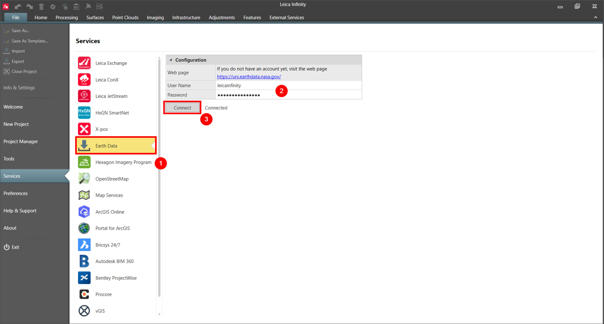
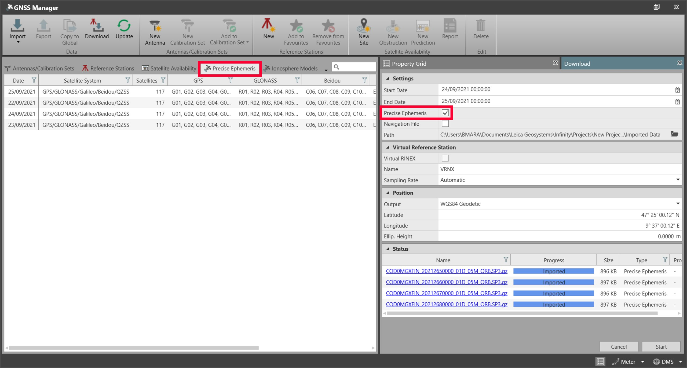

# Earth Data

### Earth Data

Infinity supports the download of several GNSS data, such as reference stations, precise ephemeris or navigation files.

To access the data, some providers require you to register and log in. Under File > Services, you can log in to the Earth Data provider.

**File**

**Services**

Log in to Earth Data

**Log in to Earth Data**

Earth Data is used by Infinity to download precise and rapid ephemeris from the Crustal Dynamics Data Information System (CDDIS) archive https://cddis.nasa.gov/archive/gps/products/mgex/

If you do not have an account yet, visit the web page Earth Data Login https://urs.earthdata.nasa.gov/

To log in with your credentials:

**To log in with your credentials:**

|  |  |
| --- | --- |

| 1. | Select File, then Services and then Earth Data from the menu. |
| --- | --- |
| 2. | Enter your User Name and Password. |
| 3. | Select Connect. |

**File**

**Services**

**Earth Data**

**User Name**

**Password**

**Connect**

When logged in you can download precise ephemeris from the GNSS Manager > Precise Ephemeris tab by enabling the Precise Ephemeris checkbox.

**GNSS Manager**

**Precise Ephemeris**

**Precise Ephemeris**

|  |  |
| --- | --- |

See also:

**See also:**

Download Precise Ephemeris from the Internet:

