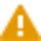

# Edit Setup Wizard: Compute Setup

### Edit Setup Wizard: Compute Setup

For all target observations, selected in the Step 2: Setup Observations, the target points are listed in the target info content view. But, if a target point disposes of more than one point role, then by default always the role from the top of the hierarchy is selected.

Thus:

**Thus:**

| 1. | Select the    option to select the target point role needed for recalculating the setup from a flyout list. Leave the flyout with OK to take over your selection. |
| --- | --- |
| 2. | When you are recalculating a Resection choose from the Parameters section:The Adjustment Method: Least Squares or Robust.Whether Easting, Northing, Height and Orientation shall be calculated or just the position and the orientation or just the station coordinates.Whether a Scale shall be computed.If you decide to compute the scale factor then you can decide further down under Station Point whether the scale shall be    Applied to all observations that have possibly been measured on the station point of the resection.To remove the scale, select the    option under Station Scale in the Setup Properties window. |

**OK**

- The Adjustment Method: Least Squares or Robust.
- Whether Easting, Northing, Height and Orientation shall be calculated or just the position and the orientation or just the station coordinates.
- Whether a Scale shall be computed.

**Applied to all observations**

To remove the scale, select the    option under Station Scale in the Setup Properties window.

In the station point section you can review:

**In the station point section you can review:**

- The azimuth, calculated with respect to the chosen target points and observations.
- The calculated orientation correction.
- The station coordinates.

For resections, the standard deviations for the Azimuth and the station coordinates are given as well.

In the tolerances section:

**In the tolerances section:**

| 3. | Define the limits for how much the measured target point position and height are allowed to differ from the target point position and height after recalculation. |
| --- | --- |
| 4. | For resections also define an orientation limit, as in a limit for how much the Hz observations to each target point are allowed to differ from the calculated values. |
| 5. | Decide whether you want to    run a tolerance check for the position and/or height and/or orientation of the target points using the given limits. |

**tolerance check**

When you decide to check whether the target points calculated from the recomputed station point lie within the defined tolerances you see that outliers are marked by    and the Δ values are written in red in the Target Info content view.

**Target Info**

| 6. | Exclude outliers from use in the setup computation by double-clicking slowly onto a target points Use field and selecting None or use just Position or just Height from the drop-down list. All computation results are recalculated and shown to you instantly. |
| --- | --- |
| 7. | Select Finish. |

**Use**

**None**

**Finish**

Before the computation results are taken over into your project you get a    warning message that the coordinates and orientation of the recalculated setup are to change by the given Δ values.

| 8. | Select OK to update the setup in your project. |
| --- | --- |

**OK**

