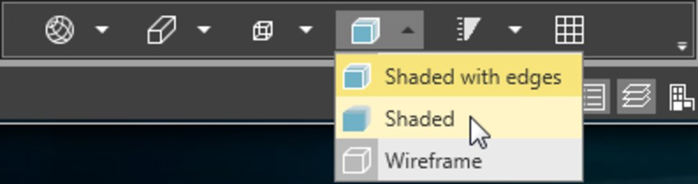
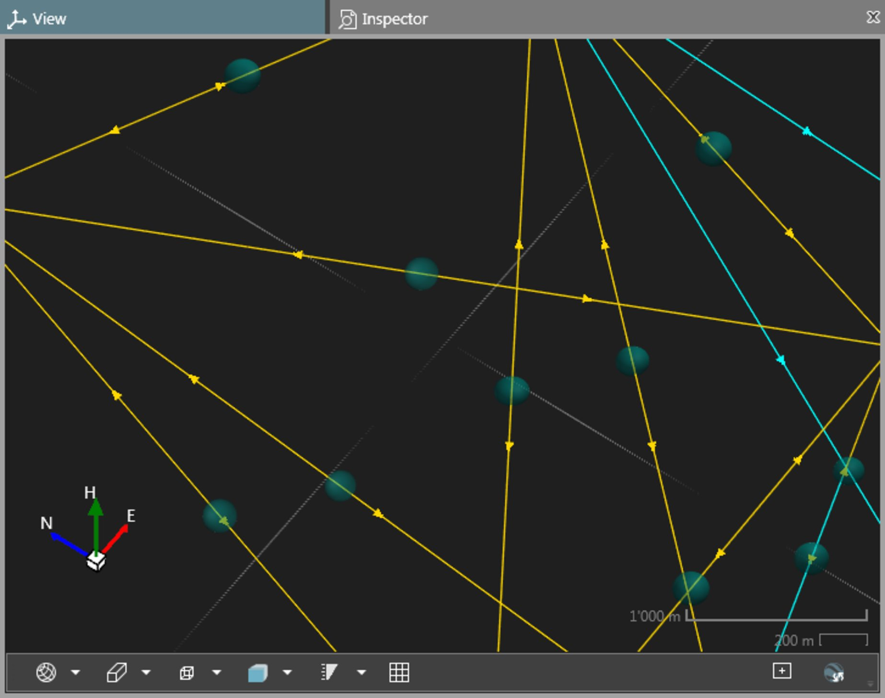

# Error Ellipses/Ellipsoids

### Error Ellipses/Ellipsoids

A surveying network can be checked in terms of both, accuracy and precision. The most common approach to check a network precision is the calculation of the absolute and relative error ellipses.

Infinity can display both kinds of ellipses/ellipsoids in the graphical view as well as show the respective information in the inspector and the network adjustment report.

To show the error ellipses/ellipsoids in the graphical view:

**To show the error ellipses/ellipsoids in the graphical view:**

| 1. | Run a network adjustment in 2D or 3D. |
| --- | --- |
| 2. | Store the result. |
| 3. | Activate (switch on:   ) the Absolute Error Ellipses and Relative Error Ellipses layers in the Layer Manager. |
| 4. | Switch the graphical view to display objects as Shaded or Shaded with Edges. |

**Absolute Error Ellipses**

**Relative Error Ellipses**

**Shaded**

**Shaded with Edges**

For further information on how to run adjustments and store results, see Adjustments.

If the graphical view is in 3D mode, then error ellipsoids are shown (instead of 2D error ellipses).

On how to switch between standard views, see Graphical View.

Error ellipses/ellipsoids are only shown if you run the adjustment using standard confidence levels, that is 68.3% for heights - 1D and 39.4% for absolute and relative error ellipses - 2D.

If you choose other confidence levels, then the graphical view shows confidence ellipses/ellipsoids instead.

Illustration:

**Illustration:**

|  |  |
| --- | --- |

If errors are too small, go to Settings > General and enlarge the Visualisation Exaggeration Factors. Else you might not be able to see the reliability boxes.

**Settings**

**General**

**Visualisation Exaggeration Factors**

If errors are below the given threshold value they are not shown. Set the threshold to a value smaller than the errors.

See also:

**See also:**

General Adjustment Settings

