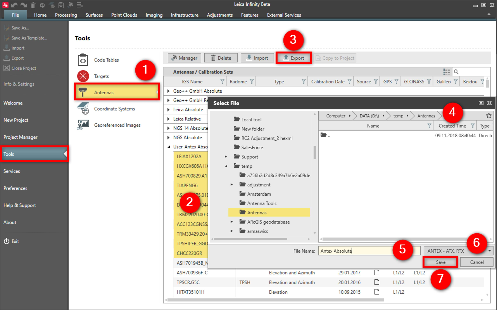

# Export

### Export

The following actions can also be done from within the GNSS Manager.

To export an antenna:

**To export an antenna:**

|  |  |
| --- | --- |

| 1. | Select File, then Tools and then Antennas from the menu. |
| --- | --- |
| 2. | Select the antennas/calibration sets you want to export. |
| 3. | Select Export. |
| 4. | Select the folder location to export the antennas to. |
| 5. | Specify the name. |
| 6. | Select the file type from the drop-down menu. |
| 7. | Select Save. |

**File**

**Tools**

**Antennas**

**Export**

**Save**

