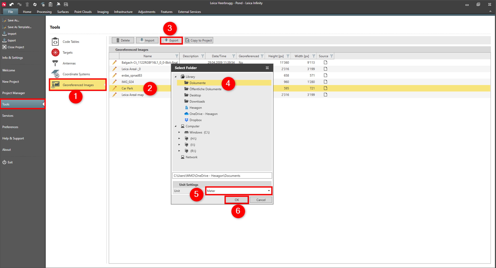

# Export

### Export

Georeferenced images can be exported in JPG format with the matching JPW world file.

**Requirements:**

- The image must be georeferenced.

To export an image:

**To export an image:**

|  |  |
| --- | --- |

| 1. | Select File, then Tools and then Georeferenced Images from the menu. |
| --- | --- |
| 2. | Select the image you want to export. |
| 3. | Select Export. |
| 4. | Select the file location. |
| 5. | Select the unit settings. |
| 6. | Select OK. |

**File**

**Tools**

**Georeferenced Images**

**Export**

**OK**

To export a georeferenced image to Captivate simply attach it to a project and export the project to Captivate.

See also:

**See also:**

Local and Global Data Objects

Georeference Images

The video "Leica Infinity - Home Module - Georeferencing Images" https://www.youtube.com/watch?v=m-U29-ipJgs

**"Leica Infinity - Home Module - Georeferencing Images"**

