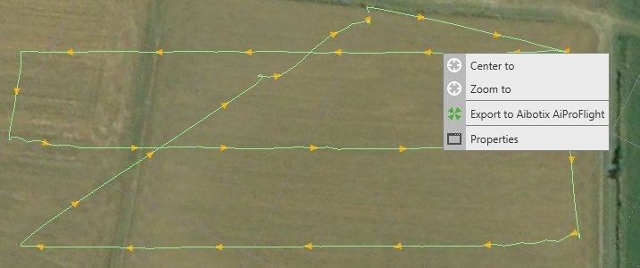
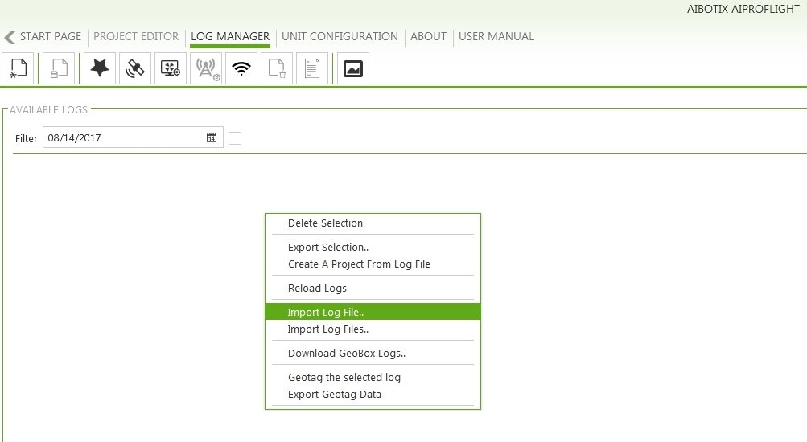
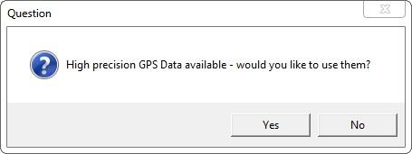
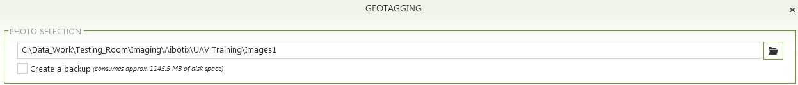
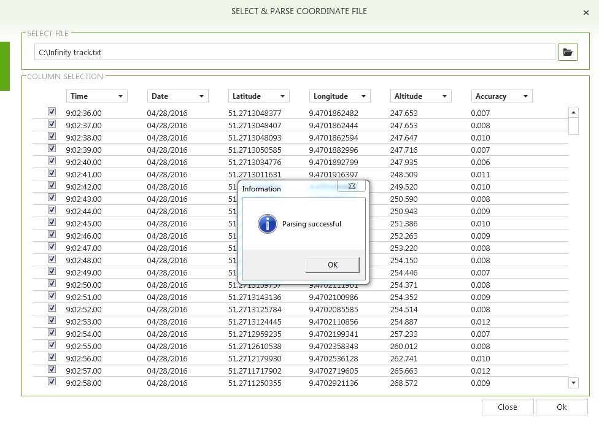
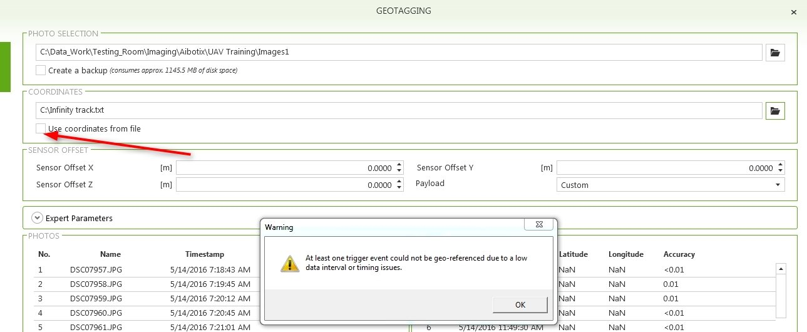

# Export UAV Track and Import to AiProFlight Software

### Export UAV Track and Import to AiProFlight Software

UAV data coming from the Aibot can be processed by Infinity.

Process the track and then export an updated coordinate file that is used to update the geotags of the images in the AiProFlight software.

In Infinity:

**In Infinity:**

| 1. | Select the track from the graphical view. |
| --- | --- |
| 2. | Select Export to Aibotix AiProFlight from the context menu. |
| 3. | In the Export dialog, enter all the necessary information. |
| 4. | Select Export to create a txt file which can be used in AiProFlight. |

**track**

**Export to Aibotix AiProFlight**

**Export**

In AiProFLight:

**In AiProFLight:**

| 1. | Go to the Log Manager tab. |
| --- | --- |
| 2. | Right-click on the white tab and select Import Log File. |
| 3. | Select your log file. The log file is provided to you together with the flight data and the photos. |
| 4. | Select the imported Log File. Right-click and select Geotag the selected log. |
| 5. | A question might pop up in case the log file contains high precision GPS data: |
| 6. | Select Yes to continue using high precision GPS data. |
| 7. | In the Photo Selection tab, select the folder that contains the photos of the specific flight. Import your photos. |
| 8. | In the Coordinates tab, import the output file from Infinity. |
| 9. | Once the file is imported, activate Use Coordinates from file. |
| 10. | On how to update the image geotags and the steps that are necessary to do so, refer to the Aibot Help. |

**Log Manager**

**Import Log File**

**Log File**

**Geotag the selected log**

**Yes**

**Photo Selection**

**Coordinates**

**Use Coordinates from file**

