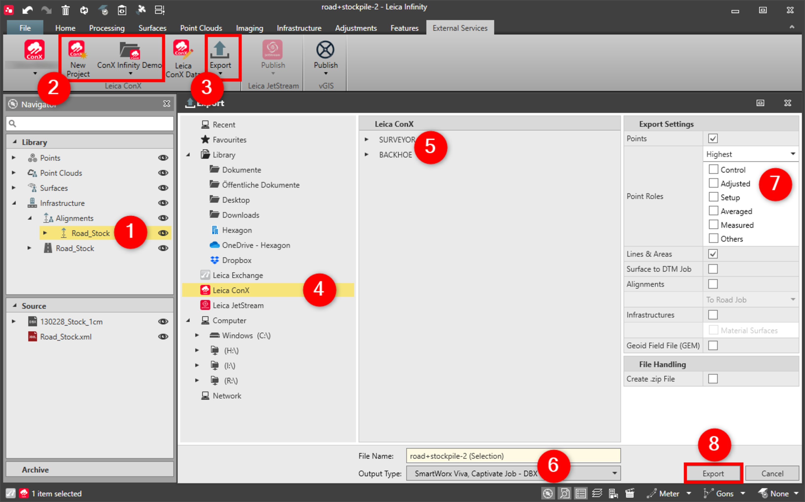

# Export to Leica ConX

### Export to Leica ConX

**Requirements:**

- Valid subscription.

To export data to an iCON project:

**To export data to an iCON project:**

|  |  |
| --- | --- |

| 1. | In the Infinity project, select the data to export, for example the centreline of the road. |
| --- | --- |
| 2. | Create a new project or select one of the available projects.The ConX user ID requires administrator rights to create new projects. |
| 3. | Select Export and then Selection from the External Services tab.Alternatively you can select Export from the Home tab. |
| 4. | In the Export dialog, select Leica ConX in the tree view. |
| 5. | Optionally select a unit. |
| 6. | Define the File Name and Output Type.HeXML is the default. |
| 7. | Define the Export Settings. |
| 8. | Select Export .If selected, the HeXML file is written to the iCON project on the server and to the unit.See the data being assigned to the iCON project in the Leica ConX project viewer.The exported file is written to the Leica Infinity Archive > Exported Files. |

The ConX user ID requires administrator rights to create new projects.

**Export**

**Selection**

**External Services**

Alternatively you can select Export from the Home tab.

**Export**

**Home**

**Leica ConX**

HeXML is the default.

**Export**

If selected, the HeXML file is written to the iCON project on the server and to the unit.

See the data being assigned to the iCON project in the Leica ConX project viewer.

The exported file is written to the Leica Infinity Archive > Exported Files.

**Archive**

**Exported Files**

See also:

**See also:**

Leica ConX

Leica ConX

